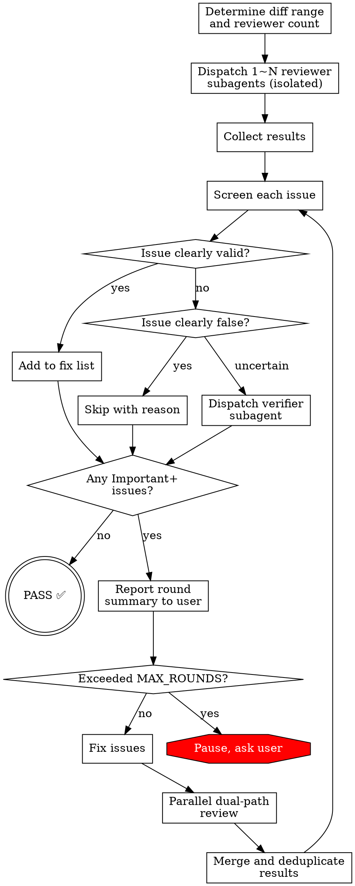

# Review Loop Skill Implementation Plan

> **For agentic workers:** REQUIRED SUB-SKILL: Use superpowers:subagent-driven-development (recommended) or superpowers:executing-plans to implement this plan task-by-task. Steps use checkbox (`- [ ]`) syntax for tracking.

**Goal:** Create a local global Claude Code skill (`~/.claude/skills/review-loop/`) that performs iterative multi-round code review with isolated subagents, verification of findings, and parallel review after fixes.

**Architecture:** Four markdown files — one main SKILL.md defining the flow and rules, plus three prompt templates (reviewer, fix-reviewer, verifier) with placeholder variables filled by the controller at dispatch time. The skill is self-contained with no code dependencies.

**Tech Stack:** Markdown skill files, Claude Code Agent tool for subagent dispatch, git for diff ranges.

**Spec:** `docs/superpowers/specs/2026-03-31-review-loop-design.md`

---

### Task 1: Create reviewer-prompt.md

**Files:**
- Create: `~/.claude/skills/review-loop/reviewer-prompt.md`

This is the full-review subagent prompt template. The controller fills placeholders before dispatch.

- [ ] **Step 1: Create the reviewer prompt template**

```markdown
# Code Review Agent

You are performing an independent code review. Review thoroughly and list ALL issues you find — completeness is critical.

## Context

- **Review round:** {ROUND_NUMBER}
- **Diff range:** {BASE_SHA}..{HEAD_SHA}
- **Change description:** {DESCRIPTION}
- **Your focus areas:** {FOCUS_AREAS}

## Project Conventions

{PROJECT_CONVENTIONS}

## Instructions

1. Run `git diff --stat {BASE_SHA}..{HEAD_SHA}` to see scope
2. Run `git diff {BASE_SHA}..{HEAD_SHA}` to read all changes
3. Read surrounding source files for context where needed
4. Review against your focus areas AND general code quality
5. If requirements/plan are provided, verify spec compliance

## Requirements/Plan (if available)

{PLAN_OR_REQUIREMENTS}

## Review Checklist

**Code Quality:**
- Clean separation of concerns?
- Proper error handling?
- Type safety (if applicable)?
- DRY principle followed?
- Edge cases handled?

**Architecture:**
- Sound design decisions?
- Scalability considerations?
- Performance implications?
- Security concerns?

**Testing:**
- Tests actually test logic (not just mocks)?
- Edge cases covered?
- Integration tests where needed?
- All tests passing?

**Spec Compliance (if requirements provided):**
- All requirements met?
- Implementation matches spec?
- No scope creep?
- No missing features?

## Output Format

### Strengths
[What's well done — be specific with file:line references]

### Issues

List ALL issues found. Do NOT omit issues — list everything, even if there are many. Completeness is essential.

For each issue:
- **Severity:** Critical / Important / Minor
- **Location:** file:line
- **Description:** what the problem is
- **Rationale:** why this is a problem
- **Suggested fix:** concrete recommendation

Group by severity:

#### Critical (Must Fix)
[Bugs, security issues, data loss risks, broken functionality]

#### Important (Should Fix)
[Architecture problems, missing error handling, test gaps, spec deviations]

#### Minor (Nice to Have)
[Code style, optimization opportunities, documentation]

### Assessment

**Pass / Fail**

**Summary:** [1-2 sentence technical assessment]

## Critical Rules

**DO:**
- Categorize by actual severity (not everything is Critical)
- Be specific — always include file:line
- Explain WHY each issue matters
- List ALL issues exhaustively — do not skip or summarize away problems
- Acknowledge strengths

**DON'T:**
- Say "looks good" without thorough checking
- Mark nitpicks as Critical
- Give feedback on code you didn't actually read
- Be vague ("improve error handling" — say WHERE and HOW)
- Omit issues because there are "too many" — list every one
```

- [ ] **Step 2: Verify file exists and content is correct**

Run: `cat ~/.claude/skills/review-loop/reviewer-prompt.md | head -5`
Expected: Shows "# Code Review Agent" header

- [ ] **Step 3: Commit**

```bash
git add ~/.claude/skills/review-loop/reviewer-prompt.md
git commit -m "feat(review-loop): add full reviewer prompt template"
```

---

### Task 2: Create fix-reviewer-prompt.md

**Files:**
- Create: `~/.claude/skills/review-loop/fix-reviewer-prompt.md`

This is the fix-diff reviewer template (Path A). Reviews only the fix commits, focusing on correctness and regressions. Does NOT know what the original issues were — avoids confirmation bias.

- [ ] **Step 1: Create the fix reviewer prompt template**

```markdown
# Fix Diff Review Agent

You are reviewing a diff that represents recent fixes to a codebase. Your job is to verify the fixes are correct and haven't introduced new problems.

**Important:** You are NOT told what the original issues were. This is intentional — review the diff on its own merits without confirmation bias.

## Context

- **Diff range:** {FIX_BASE_SHA}..{FIX_HEAD_SHA}
- **Change description:** Recent fixes applied to the codebase

## Project Conventions

{PROJECT_CONVENTIONS}

## Instructions

1. Run `git diff --stat {FIX_BASE_SHA}..{FIX_HEAD_SHA}` to see scope
2. Run `git diff {FIX_BASE_SHA}..{FIX_HEAD_SHA}` to read all changes
3. Read surrounding source files for context
4. Focus on: Are these changes correct? Do they introduce new problems?

## Review Focus

- **Fix correctness:** Do the changes make logical sense? Are they complete?
- **Regressions:** Do the changes break existing functionality?
- **Side effects:** Do the changes have unintended consequences on other parts of the code?
- **Test coverage:** Are the fixes covered by tests? Were existing tests updated if behavior changed?
- **Code quality:** Do the fixes follow project conventions? Any shortcuts taken?

## Output Format

### Strengths
[What's well done in the fixes — be specific with file:line]

### Issues

List ALL issues found. Do NOT omit any.

For each issue:
- **Severity:** Critical / Important / Minor
- **Location:** file:line
- **Description:** what the problem is
- **Rationale:** why this is a problem
- **Suggested fix:** concrete recommendation

#### Critical (Must Fix)
[New bugs introduced, broken functionality, security issues]

#### Important (Should Fix)
[Incomplete fixes, missing test updates, new code quality issues]

#### Minor (Nice to Have)
[Style, minor improvements]

### Assessment

**Pass / Fail**

**Summary:** [1-2 sentence assessment of fix quality]

## Critical Rules

**DO:**
- Review the diff independently — don't speculate about what was "supposed" to be fixed
- Check that fixes don't break other code paths
- Verify test coverage of changed code
- List ALL issues exhaustively

**DON'T:**
- Assume the fixes are correct because they look intentional
- Skip checking surrounding code for side effects
- Omit issues — list everything
```

- [ ] **Step 2: Verify file exists**

Run: `cat ~/.claude/skills/review-loop/fix-reviewer-prompt.md | head -5`
Expected: Shows "# Fix Diff Review Agent" header

- [ ] **Step 3: Commit**

```bash
git add ~/.claude/skills/review-loop/fix-reviewer-prompt.md
git commit -m "feat(review-loop): add fix diff reviewer prompt template"
```

---

### Task 3: Create verifier-prompt.md

**Files:**
- Create: `~/.claude/skills/review-loop/verifier-prompt.md`

Independent verifier for uncertain issues. Does not know which reviewer raised the issue or the controller's leaning.

- [ ] **Step 1: Create the verifier prompt template**

```markdown
# Issue Verification Agent

You are independently verifying whether a reported code issue is real. You have NO context about who reported this or why — judge purely on code evidence.

## Reported Issue

{ISSUE_DESCRIPTION}

## Involved Files

{FILE_PATHS}

## Project Conventions

{PROJECT_CONVENTIONS}

## Instructions

1. Read the involved source files thoroughly
2. Understand the surrounding context and how the code is used
3. Independently determine: does this issue actually exist in the code?
4. If it exists: is fixing it necessary, beneficial, or risky?

## Evaluation Criteria

- **Does the code actually exhibit this problem?** Read it yourself — don't trust the description blindly
- **Is this a real issue or a misunderstanding?** The reporter may have missed context (architectural conventions, intentional patterns, etc.)
- **What's the fix cost vs. benefit?** A real issue may still not be worth fixing if the fix is risky or the impact is negligible
- **Could the fix cause regressions?** Consider side effects

## Output

### Verdict

One of:
- **Confirmed** — issue exists and should be fixed
- **Not confirmed** — issue does not exist or is based on misunderstanding
- **Exists but no fix needed** — issue is real but fixing is unnecessary or too risky

### Evidence

[Specific code references (file:line) that support your verdict. Quote relevant code.]

### Fix Direction (if confirmed)

[Concrete suggestion for how to fix, if you confirmed the issue needs fixing.]
```

- [ ] **Step 2: Verify file exists**

Run: `cat ~/.claude/skills/review-loop/verifier-prompt.md | head -5`
Expected: Shows "# Issue Verification Agent" header

- [ ] **Step 3: Commit**

```bash
git add ~/.claude/skills/review-loop/verifier-prompt.md
git commit -m "feat(review-loop): add issue verifier prompt template"
```

---

### Task 4: Create SKILL.md — Frontmatter and Overview

**Files:**
- Create: `~/.claude/skills/review-loop/SKILL.md`

This is the main skill file. Due to its length, we create it in steps. First: frontmatter, overview, and when-to-use.

- [ ] **Step 1: Create SKILL.md with frontmatter and overview**

```markdown
---
name: review-loop
description: Use when code changes need iterative multi-round review until no Critical or Important issues remain, with isolated independent reviewers, verification of findings, and parallel review after fixes
---

# Review Loop

Iterative code review with isolated subagents. Loops until clean.

## Overview

Dispatch independent reviewer subagents → screen and verify findings → fix confirmed issues → parallel dual-path re-review (fix diff + full review) → repeat until no Critical or Important issues remain.

Each reviewer is fully isolated: no prior review conclusions, no conversation history, no knowledge of previous fixes. Only the round number and diff range are provided.

## When to Use

- After completing a feature branch, before merge
- After each task in an implementation plan
- When code quality needs thorough, iterative validation
- When a single-shot review (`requesting-code-review`) isn't sufficient

**Don't use for:**
- Quick sanity checks — use `requesting-code-review` instead
- Review of other people's PRs — this is for your own code iteration
```

- [ ] **Step 2: Verify file created**

Run: `head -5 ~/.claude/skills/review-loop/SKILL.md`
Expected: Shows YAML frontmatter

---

### Task 5: SKILL.md — Main Flow (Process Flowchart)

**Files:**
- Modify: `~/.claude/skills/review-loop/SKILL.md`

Append the core process flow section with graphviz flowchart.

- [ ] **Step 1: Append the process flow section**

Append to `SKILL.md`:

```markdown

## Process Flow



---

### Task 6: SKILL.md — Procedure Sections (Part 1: Setup and Dispatching)

**Files:**
- Modify: `~/.claude/skills/review-loop/SKILL.md`

Append the detailed procedure sections covering parameter inference, reviewer dispatch, and screening.

- [ ] **Step 1: Append setup and dispatch sections**

Append to `SKILL.md`:

```markdown

## Parameters

All optional — controller infers from context:

| Parameter | Default | Description |
|-----------|---------|-------------|
| BASE_SHA | Auto-inferred | Review start point |
| HEAD_SHA | HEAD | Review end point |
| DESCRIPTION | From git log | Brief change description |
| PLAN_OR_REQUIREMENTS | From context | Spec or requirements doc |
| MAX_ROUNDS | 5 | Max rounds before pausing |

**Auto-inference:**
1. Explicit commit range in conversation → use it
2. Branch has unmerged commits vs main → BASE = merge-base, HEAD = HEAD (includes uncommitted)
3. Only uncommitted changes → review working tree diff
4. Nothing → ask user

## Step 1: Determine Reviewer Count

Assess change scope with `git diff --stat`:

| Scope | Reviewers | Example focus split |
|-------|-----------|-------------------|
| Small (<100 lines, 1-2 files) | 1 | Full coverage |
| Medium (100-500 lines, multi-file) | 2 | A: logic/security/edge; B: architecture/maintainability |
| Large (>500 lines, cross-module) | 2-3 | A: logic/security; B: architecture/patterns; C: spec/tests |

Adapt focus areas to code characteristics. Database-heavy code → reviewer on SQL injection/transactions. UI-heavy → reviewer on accessibility/UX patterns.

## Step 2: Dispatch Reviewers

For each reviewer, fill `reviewer-prompt.md` template and dispatch via Agent tool:
- `subagent_type`: use `feature-dev:code-reviewer` or `general-purpose`
- Each reviewer is a **separate** Agent call — they run in parallel
- Provide only: round number, diff range, description, focus areas, project conventions
- **Never** provide: prior review results, fix history, controller opinions

## Step 3: Screen Results

For each issue reported by any reviewer:

1. **Clearly valid and necessary** → add to fix list
2. **Clearly false positive** (code doesn't have this problem, or reviewer missed context) → skip, record reason
3. **Uncertain** → dispatch verifier subagent with `verifier-prompt.md` template:
   - Provide: issue description, file paths, project conventions
   - Do NOT provide: which reviewer, your leaning
   - Verifier returns: Confirmed / Not confirmed / Exists but no fix needed

**Multi-reviewer dedup:** Same file:line with same issue type → merge, take higher severity.
```

---

### Task 7: SKILL.md — Procedure Sections (Part 2: Fixing, Re-review, Termination)

**Files:**
- Modify: `~/.claude/skills/review-loop/SKILL.md`

Append the fixing strategy, dual-path re-review, user reporting, and termination rules.

- [ ] **Step 1: Append fix and re-review sections**

Append to `SKILL.md`:

```markdown

## Step 4: Report Round Summary to User

After screening, report concisely:

```
## Round N Review
- Issues found: X (Critical: a, Important: b, Minor: c)
- Verification: confirmed Y, excluded Z false positives
- Fixed: W
- Remaining Minor (non-blocking): list
- Status: continuing / passed / paused at limit
```

If no Important+ issues → report and exit (PASS).

## Step 5: Fix Confirmed Issues

Choose strategy based on issue characteristics:

- **Simple issues** (typo, missing null check, small logic fix) → fix directly
- **Complex single issue** (architectural change, multi-file refactor) → dispatch 1 fixer subagent
- **Multiple independent issues** → dispatch N fixer subagents in parallel (one per issue or per related group)

Fixer subagents receive: issue description, file paths, project conventions, concrete fix suggestion from reviewer. They commit their fixes.

## Step 6: Dual-Path Parallel Review

After fixes, dispatch two review paths **in parallel**:

**Path A — Fix diff review:**
- 1 subagent with `fix-reviewer-prompt.md`
- Diff range: only the fix commits
- Does NOT know what the original issues were

**Path B — Full review (new round):**
- 1~N subagents with `reviewer-prompt.md` (same count logic as Step 1)
- Diff range: original BASE_SHA..HEAD (now includes fixes)
- Fully isolated — no knowledge of any prior round

Both paths return results → merge and deduplicate → back to Step 3 (Screen Results).

## Step 7: Termination

**Pass condition:** No Critical or Important issues after screening. Minor issues are listed but don't block.

**Max rounds (default 5):** After MAX_ROUNDS cycles, pause and present to user:
- Remaining Important+ issue list
- Summary of all rounds (issues found/fixed per round)
- Recommendation: continue, stop, or adjust strategy

**Ask user when:**
- Fix direction involves architectural trade-offs with multiple valid options
- Verifier contradicts reviewer and you can't judge who's right
- Fix scope would exceed current task boundaries

## Final Output

When review-loop ends:

```
## Review Loop Result
- Total rounds: N
- Status: Passed / User terminated
- Issues per round: Round 1: X, Round 2: Y, ...
- Total issues fixed: Z
- Remaining Minor issues: (list, optional fix)
```
```

---

### Task 8: SKILL.md — Isolation Rules and Common Mistakes

**Files:**
- Modify: `~/.claude/skills/review-loop/SKILL.md`

Append the isolation principles and common mistakes section.

- [ ] **Step 1: Append isolation and mistakes sections**

Append to `SKILL.md`:

```markdown

## Isolation Principles

| What | Rule |
|------|------|
| Prior review conclusions | Never passed to next round's reviewers |
| Prior fix content | Full reviewers don't know; fix reviewer only sees diff range |
| Conversation history | Not inherited; every subagent starts fresh |
| Round info | Only round number ("Round N") — no history details |
| Controller opinions | Never shared with verifiers |

**Why isolation matters:** Without it, later-round reviewers anchor on earlier findings and miss new issues. The whole point of multi-round review is independent perspectives.

## Common Mistakes

| Mistake | Fix |
|---------|-----|
| Passing prior review results to new reviewer | Only provide round number and diff range |
| Skipping verification for "obvious" issues | If you're unsure, dispatch verifier — it's cheap |
| Fixing all issues yourself instead of parallelizing | Multiple independent issues → parallel fixer subagents |
| Running only full review after fix (no fix-diff review) | Always dual-path: fix diff + full review in parallel |
| Stopping after first clean round without re-checking | If fixes were made, the dual-path review IS the re-check |
| Telling fix reviewer what the original issues were | Causes confirmation bias — let them judge the diff independently |
| Batching all rounds before reporting to user | Report after EVERY round — user needs visibility |
| Omitting issues from review output | Reviewers MUST list ALL issues exhaustively |

## Integration

| Skill | Relationship |
|-------|-------------|
| `requesting-code-review` | Complementary — single-shot vs. iterative loop |
| `subagent-driven-development` | Can invoke `review-loop` as review step per task |
| `receiving-code-review` | Controller applies its verify-before-act principles |
| `verification-before-completion` | Use after `review-loop` passes for final check |
```

- [ ] **Step 2: Verify complete SKILL.md**

Run: `wc -l ~/.claude/skills/review-loop/SKILL.md`
Expected: Roughly 150-200 lines

- [ ] **Step 3: Commit**

```bash
git add ~/.claude/skills/review-loop/SKILL.md
git commit -m "feat(review-loop): add main SKILL.md with flow, rules, and templates"
```

---

### Task 9: Baseline Test — Run Review WITHOUT Skill

**Files:** None (observation only)

Per writing-skills TDD: run a pressure scenario WITHOUT the skill first to establish baseline behavior.

- [ ] **Step 1: Find a recent code change to review**

Pick a recent commit or branch with 50-200 lines of changes in the current project.

```bash
git log --oneline -10
git diff --stat HEAD~3..HEAD
```

- [ ] **Step 2: Dispatch a review subagent WITHOUT skill**

Use the Agent tool to ask a general-purpose subagent to "iteratively review this code until clean":

```
Prompt: "Review the code changes in {BASE}..{HEAD} of this project.
If you find issues, fix them and re-review until no important issues remain.
Report what you found and fixed."
```

- [ ] **Step 3: Document baseline behavior**

Record:
- Did the agent do multiple rounds, or stop after one?
- Did it verify its own findings before fixing?
- Did it review its fixes separately?
- Did it report to the user between rounds?
- Did it maintain isolation between rounds?
- What rationalizations did it use to skip steps?

Save observations to `docs/superpowers/plans/2026-04-04-review-loop-baseline.md`

- [ ] **Step 4: Commit baseline**

```bash
git add docs/superpowers/plans/2026-04-04-review-loop-baseline.md
git commit -m "test(review-loop): document baseline behavior without skill"
```

---

### Task 10: GREEN Test — Run Review WITH Skill

**Files:** None (observation only)

- [ ] **Step 1: Dispatch review WITH skill loaded**

Use the same code change as Task 9. This time, invoke the `review-loop` skill and observe behavior.

- [ ] **Step 2: Compare with baseline**

Verify the skill causes the agent to:
- ✅ Dispatch isolated reviewer subagents
- ✅ Screen findings and verify uncertain ones
- ✅ Report round summary to user
- ✅ Fix and do dual-path parallel re-review
- ✅ Maintain isolation between rounds
- ✅ List ALL issues exhaustively (not just top few)
- ✅ Loop until clean or MAX_ROUNDS

- [ ] **Step 3: Document results and any loopholes**

Record which behaviors improved vs. baseline and any new rationalizations or loopholes found.

- [ ] **Step 4: If loopholes found, fix SKILL.md (REFACTOR)**

Add explicit counters for any rationalizations observed. Re-test affected scenarios.

- [ ] **Step 5: Commit final skill**

```bash
cd ~/.claude/skills/review-loop
git add -A
git commit -m "feat(review-loop): finalize skill after TDD verification"
```
