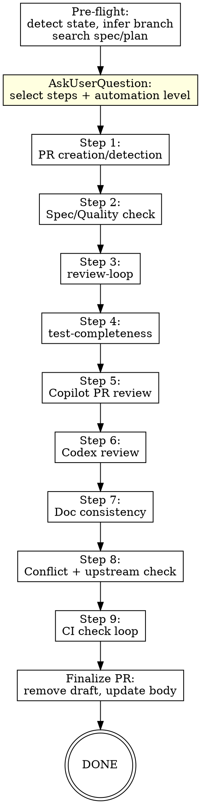

# Finish Feature Skill Design Spec

**Date:** 2026-04-05
**Skill name:** `finish-feature`
**Location:** `plugins/winrey-toolkit/skills/finish-feature/`

## Overview

An orchestration skill that guides a feature branch through a comprehensive quality pipeline before merge. Runs 9 sequential steps: PR creation, spec/quality check, review-loop, test-completeness, Copilot PR review, Codex review, documentation consistency, conflict check, and CI verification.

Each step runs once to completion. Later steps do not re-trigger earlier steps — CI at the end serves as the final safety net.

## Design Decisions

| Dimension | Decision |
|-----------|----------|
| Trigger | Manual (`/finish-feature`) |
| Execution model | Strict sequential pipeline (Approach A) |
| Regression policy | No re-run of earlier steps after later fixes; CI is the backstop |
| User interaction | Pre-flight step/automation selection via AskUserQuestion |
| Automation levels | `full` / `confirm` / `checkpoint` |
| PR target branch | Auto-infer (dev > main), fall back to memory, then ask user |
| Idempotency | Detect existing PR and checklist state to suggest skipping completed steps |

## File Structure

```
plugins/winrey-toolkit/skills/finish-feature/
├── SKILL.md                    # Main skill definition (Controller)
├── spec-checker-prompt.md      # Spec/Quality check subagent template
├── doc-checker-prompt.md       # Documentation consistency subagent template
└── codex-reviewer-prompt.md    # Codex review prompt template
```

## Parameters

| Parameter | Default | Description |
|-----------|---------|-------------|
| TARGET_BRANCH | Auto-inferred | PR target branch (dev > main; infer → memory → ask user) |
| SPEC_PATH | Auto-searched | Design spec document path |
| PLAN_PATH | Auto-searched | Implementation plan path |
| AUTOMATION | Ask user | `full` / `confirm` / `checkpoint` |

## Automation Levels

| Level | Behavior |
|-------|----------|
| `full` | Fully automatic. Only pauses on errors, trade-off decisions, or max-round limits |
| `confirm` | Pauses at key decision points: fix proposals, PR description, review opinion disputes |
| `checkpoint` | Pauses after every step with a summary report, waits for user confirmation to continue |

## Pre-flight

1. **Detect project state:** current branch, uncommitted changes, existing PR
2. **Infer target branch:** check if `dev`/`develop` branch exists → yes: use it; no: check memory; still no: AskUserQuestion
3. **Search spec/plan:** scan `docs/` for design/plan documents matching current branch name
4. **Present step checklist:** AskUserQuestion listing all 9 steps, default all selected, note which may have been done (detect from PR body checklist if PR exists)
5. **Select automation level:** AskUserQuestion with `full` / `confirm` / `checkpoint` options

## Review Opinion Handling Principle

Applies to all steps that receive review feedback (Steps 3, 5, 6):

```
For each review opinion:
  ├─ Clearly valid → add to fix list, fix code
  ├─ Clearly invalid/false positive →
  │    ├─ Do NOT fix
  │    ├─ Add reply comment explaining why (PR comment for Copilot, summary for Codex)
  │    ├─ Resolve the conversation (Copilot) or note in report (Codex)
  │    └─ automation=confirm/checkpoint → show user before declining
  └─ Uncertain →
       ├─ automation=full → dispatch verifier subagent (review-loop) or read context and judge conservatively
       ├─ automation=confirm/checkpoint → show user with analysis, let user decide
       └─ After judgment → treat as valid or invalid accordingly
```

## Step 1: PR Creation

### Logic

```
Check existing PR: gh pr view
  ├─ Already exists → skip, record PR URL/number
  └─ Does not exist → create PR
       ├─ Collect info: git log, diff stat, spec summary
       ├─ Generate PR title + body (reference spec/plan if available)
       ├─ automation=full → create directly
       ├─ automation=confirm/checkpoint → show draft for user confirmation
       └─ gh pr create --draft --title "..." --body "..."
```

- **Default: Draft PR** — subsequent steps are still running, don't want premature merge
- **PR body** includes a Quality Checklist with all 9 steps as `[ ]` checkboxes
- **Target branch:** use pre-flight inferred `TARGET_BRANCH`
- After creation, record PR number for subsequent steps (Copilot review, CI checks)

### PR Body Template

```markdown
## Summary
{generated from spec or git log}

## Quality Checklist
- [ ] Spec/Quality check
- [ ] Review loop (Claude)
- [ ] Test completeness
- [ ] Copilot review
- [ ] Codex review
- [ ] Documentation consistency
- [ ] No merge conflicts
- [ ] CI passing

## Test Plan
{extracted from test files or spec}
```

Each step updates its corresponding checkbox upon completion.

## Step 2: Spec/Quality Check

### Routing Logic

```
Has plan/spec?
  ├─ Has plan → per-task check
  │    ├─ Extract task list and acceptance criteria from plan
  │    ├─ Dispatch spec-checker subagent per task (parallel)
  │    │    ├─ Input: task description, acceptance criteria, relevant code files, spec requirements
  │    │    └─ Output: PASS/FAIL + deviation list
  │    └─ Merge into summary report
  ├─ Has spec, no plan → per-module check
  │    ├─ Group changed files by module from diff
  │    ├─ Dispatch spec-checker subagent per module (parallel)
  │    │    ├─ Input: module files, relevant spec sections, code
  │    │    └─ Output: completeness + quality report
  │    └─ Merge into summary report
  └─ Neither → generic quality check
       ├─ Dispatch subagent for general code quality review on diff
       └─ Check: naming, error handling, type safety, code smells
```

### Spec-Checker Dimensions

| Dimension | Description |
|-----------|-------------|
| Functional completeness | Does code implement all features required by spec/task? |
| Acceptance criteria | Are all acceptance criteria from plan satisfied? |
| Interface consistency | Do actual APIs/interfaces match spec definitions? |
| Code quality | Naming, structure, error handling, type safety |
| Omission detection | Features mentioned in spec but missing in code |

### Remediation

- Critical/Important issues → fix code
- automation=confirm: show fix proposal, wait for user confirmation
- After fixes, update PR body checkbox

## Step 3: review-loop

Invoke skill `winrey-toolkit:review-loop` with:

| Parameter | Value |
|-----------|-------|
| BASE_SHA | `merge-base(HEAD, TARGET_BRANCH)` |
| HEAD_SHA | `HEAD` |
| DESCRIPTION | From spec/PR body |
| PLAN_OR_REQUIREMENTS | SPEC_PATH content (if available) |

The skill handles its own multi-round iteration, verification, and fixing internally. Controller passes parameters and waits for result. After completion, update PR body checkbox.

### Automation Adaptation

| Level | Behavior |
|-------|----------|
| `full` | review-loop runs autonomously, pauses only at max rounds |
| `confirm` | Fix proposals shown to user for confirmation |
| `checkpoint` | Pause after review-loop completes, report results |

## Step 4: test-completeness

Invoke skill `winrey-toolkit:test-completeness` with:

| Parameter | Value |
|-----------|-------|
| scope | `diff` |
| base | `TARGET_BRANCH` |
| mode | interactive (allows generating and fixing tests) |

The skill handles its own dynamic + static audit, remediation loop, and verification internally. After completion, update PR body checkbox.

### Automation Adaptation

Same pattern as Step 3: `full` = autonomous, `confirm` = show test proposals, `checkpoint` = pause after completion.

## Step 5: Copilot PR Review

### Trigger

```
gh pr edit <PR_NUMBER> --add-reviewer @copilot
  ├─ Success → enter polling loop
  └─ Failure →
       ├─ Repo doesn't have Copilot review enabled → report, skip step
       └─ Other error → report, ask user whether to skip
```

### Wait and Fetch

```
Poll for Copilot review completion:
  ├─ gh api repos/{owner}/{repo}/pulls/{pr}/reviews
  ├─ Filter: user.login == "copilot-pull-request-reviewer[bot]"
  ├─ Check state: APPROVED / CHANGES_REQUESTED / COMMENTED
  ├─ Poll interval: 30s, max wait: 10 minutes
  ├─ Timeout → report, ask user: wait / skip / manually trigger
  └─ Complete → fetch all review comments
```

### Opinion Processing

```
Fetch Copilot review comments:
  ├─ Parse each comment: file path, line number, content, severity
  ├─ Apply Review Opinion Handling Principle for each comment:
  │    ├─ Valid → fix code
  │    ├─ Invalid →
  │    │    ├─ Reply via: gh api repos/{owner}/{repo}/pulls/{pr}/comments/{id}/replies -f body="..."
  │    │    └─ Resolve via GraphQL: resolveReviewThread(input: {threadId: $id})
  │    └─ Uncertain → judge per automation level
  ├─ After fixes → push code
  ├─ For fixed comments → reply "Fixed in <commit_sha>" and resolve
  └─ Update PR body checkbox
```

### GitHub API Reference

| Operation | Method |
|-----------|--------|
| Add reviewer | `gh pr edit <PR> --add-reviewer @copilot` |
| Get reviews | `gh api repos/{owner}/{repo}/pulls/{pr}/reviews` |
| Get comments | `gh api repos/{owner}/{repo}/pulls/{pr}/comments` |
| Reply to comment | `gh api repos/{owner}/{repo}/pulls/{pr}/comments/{id}/replies -f body="..."` |
| Get thread IDs | GraphQL query `pullRequest.reviewThreads` |
| Resolve thread | GraphQL mutation `resolveReviewThread(input: {threadId: $id})` |

### Notes

- Copilot may return a general review instead of line-by-line comments — handle both formats
- If Copilot gives "request changes" but all specific opinions are validly declined, the step still passes
- No re-trigger after pushing fixes (per Approach A: no re-run)

## Step 6: Codex Review

### Dispatch

Delegate review task to Codex via `codex:rescue` skill. Construct prompt using `codex-reviewer-prompt.md` template.

**Template placeholders:**

| Placeholder | Description |
|-------------|-------------|
| `{DIFF_RANGE}` | BASE_SHA..HEAD |
| `{DESCRIPTION}` | PR/feature description |
| `{SPEC_SUMMARY}` | Key spec requirements summary (if available) |
| `{PROJECT_CONVENTIONS}` | Project conventions (language, framework, style) |

**Codex output requirement:** Structured issue list, each with file path, line number, severity, description, suggested fix.

### Claude Validation

```
Receive Codex review opinions:
  ├─ For each opinion (apply Review Opinion Handling Principle):
  │    ├─ Read relevant code context, judge independently
  │    ├─ Valid → fix code
  │    ├─ Invalid →
  │    │    ├─ Record in round summary: issue description + rejection reason
  │    │    ├─ automation=confirm/checkpoint → show user to confirm rejection
  │    │    └─ automation=full → reject autonomously
  │    └─ Uncertain →
  │         ├─ automation=full → lean conservative, fix
  │         └─ automation=confirm/checkpoint → ask user
  ├─ After fixes → push
  └─ Update PR body checkbox
```

### Difference from Step 3 review-loop

| | Step 3 review-loop | Step 6 Codex review |
|---|---|---|
| Model | Claude subagents | Codex/GPT |
| Rounds | Multi-round iteration until PASS | Single round |
| Verification | Built-in verifier subagent | Claude controller validates |
| Value | Deep iterative polishing | Different model perspective, catches Claude blind spots |

## Step 7: Documentation Consistency

### Dispatch doc-checker subagent

```
Input:
  ├─ Changed file list + diff
  ├─ Project documentation files (README, docs/, API docs, CHANGELOG, etc.)
  ├─ Spec document (if available)
  └─ Code comments / JSDoc / docstrings

Check dimensions:
  ├─ README feature descriptions match code
  ├─ API documentation reflects interface changes
  ├─ Spec document needs "implemented" marking or updates
  ├─ CHANGELOG needs new entry
  ├─ Code comments/docstrings match implementation
  └─ Config documentation (env examples, deploy docs) needs updates

Output:
  ├─ Documents needing updates + specific suggestions
  └─ Documents already consistent (no changes needed)
```

### Remediation

| Level | Behavior |
|-------|----------|
| `full` | Update documents directly |
| `confirm` | Show suggestions, update after user confirmation |
| `checkpoint` | Same as confirm |

## Step 8: Conflict Check + Upstream Impact Analysis

### Step 8a: Conflict Check

```
git fetch origin TARGET_BRANCH
Attempt merge check (dry run):
  ├─ No conflicts → continue
  └─ Conflicts detected →
       ├─ Show conflicting file list
       ├─ automation=full → attempt auto-resolve using git merge; if conflicts remain, report and ask user
       ├─ automation=confirm/checkpoint → show conflicts with both sides, ask user for resolution strategy
       └─ Commit resolution
```

### Step 8b: Upstream Change Impact

```
git log origin/TARGET_BRANCH --not HEAD --oneline
  ├─ No new commits on target → skip
  └─ New commits exist →
       ├─ git diff HEAD...origin/TARGET_BRANCH -- <files touched by current branch>
       ├─ Target branch modified files in current branch scope?
       │    ├─ No → safe, continue
       │    └─ Yes → analyze functional impact
       │         ├─ No functional impact (formatting, comments) → report, continue
       │         ├─ Functional impact → report specifics + suggestions
       │         └─ automation=confirm/checkpoint → ask user if adaptation needed
       └─ Update PR body checkbox
```

## Step 9: CI Check Loop

```
Wait for CI checks:
  gh pr checks <PR_NUMBER> --watch
  ├─ All pass → PASS, update checkbox
  ├─ Failures detected →
  │    ├─ Fetch failed check logs: gh run view <run_id> --log-failed
  │    ├─ Analyze failure cause
  │    ├─ Caused by current code?
  │    │    ├─ Yes → fix code, push, wait for CI again
  │    │    └─ No (flaky test, infra issue) → report, ask user to rerun
  │    ├─ Fix loop: max 3 rounds
  │    └─ Exceeded 3 rounds → stop, report remaining failures, ask user
  └─ No CI configured → report, skip
```

### CI Commands

| Operation | Command |
|-----------|---------|
| Watch checks | `gh pr checks <PR> --watch` |
| View failed logs | `gh run view <run_id> --log-failed` |
| Rerun failed | `gh run rerun <run_id> --failed` |

## Process Flow



Each step skipped by user is bypassed. If `automation=checkpoint`, a pause node is inserted after every step.

## Final Output

```markdown
## Feature Finish Report

**PR:** #123 — {title}
**Branch:** feature/xxx → dev
**Total steps executed:** 7/9 (skipped: Step 4, Step 6)

### Step Results

| Step | Status | Summary |
|------|--------|---------|
| 1. PR creation | DONE | Created #123 (draft) |
| 2. Spec/Quality | PASS | 5 tasks checked, 2 issues fixed |
| 3. review-loop | PASS | 3 rounds, 8 issues fixed |
| 4. test-completeness | SKIPPED | User skipped |
| 5. Copilot review | PASS | 4 comments: 3 fixed, 1 declined |
| 6. Codex review | SKIPPED | User skipped |
| 7. Documentation | PASS | README updated |
| 8. Conflicts | PASS | No conflicts, no upstream impact |
| 9. CI | PASS | All checks green |

### PR Status
- Draft removed
- All checklist items checked
- Ready for merge
```

## Wrap-up Actions

1. **Update PR body:** check all completed checkboxes, append finish report summary
2. **Remove draft:** `gh pr ready <PR>`
3. **Report to user:** output the report table above
4. **Memory update:** if this is the first time confirming the project's target branch, save to memory

## Error Recovery

| Scenario | Behavior |
|----------|----------|
| Step fails and cannot auto-fix | Report failure reason, ask user: skip / fix manually then continue / abort |
| User interrupts (conversation breaks) | Next run detects PR body checklist, suggests skipping completed steps |
| Push permission denied | Report error, suggest checking git remote config |
| Copilot review not available | Report, skip step, continue pipeline |
| Codex not available | Report, skip step, continue pipeline |

## Integration

| Skill | Relationship |
|-------|-------------|
| `review-loop` | Invoked as Step 3; handles its own multi-round loop |
| `test-completeness` | Invoked as Step 4; handles its own audit-fix loop |
| `codex:rescue` | Used in Step 6 to dispatch Codex review |
| `verification-before-completion` | Complementary — `finish-feature` is a superset that includes verification |
| `writing-plans` | Plans can include "run finish-feature" as the final acceptance step |
