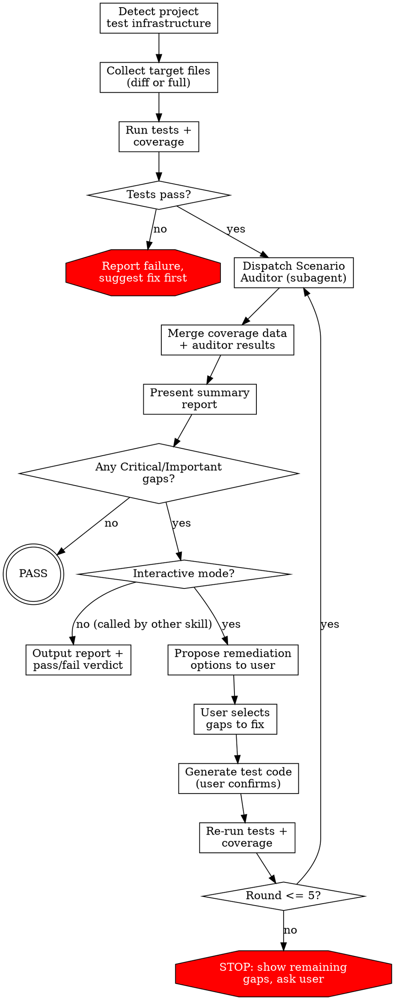

# Test Completeness Skill Implementation Plan

> **For agentic workers:** REQUIRED SUB-SKILL: Use superpowers-extended-cc:subagent-driven-development (recommended) or superpowers-extended-cc:executing-plans to implement this plan task-by-task. Steps use checkbox (`- [ ]`) syntax for tracking.

**Goal:** Create a skill that audits test completeness (good case, bad case, boundary cases, coverage, unit/integration/e2e) by combining dynamic test execution with an isolated Scenario Auditor subagent, then proposes and generates missing tests upon user confirmation.

**Architecture:** Two markdown files — one main SKILL.md defining the controller flow (project detection, test execution, report, remediation loop), plus one auditor prompt template with placeholder variables. The controller runs tests and collects coverage data directly, then dispatches the auditor subagent for static scenario analysis.

**Tech Stack:** Markdown skill files, Claude Code Agent tool for subagent dispatch, Bash for test/coverage execution, git for diff ranges.

**Spec:** `docs/2026-04-05-test-completeness-design.md`

---

### Task 1: Create auditor-prompt.md

**Goal:** Create the Scenario Auditor subagent prompt template that independently analyzes test completeness across 6 dimensions.

**Files:**
- Create: `plugins/winrey-toolkit/skills/test-completeness/auditor-prompt.md`

**Acceptance Criteria:**
- [ ] Template has all 6 placeholders ({TARGET_FILES}, {COVERAGE_DATA}, {TEST_FILES}, {PROJECT_CONTEXT}, {SCOPE}, {DESCRIPTION})
- [ ] Covers all 6 audit dimensions (good case, bad case, boundary, unit, integration, e2e)
- [ ] Output format is per-file structured with PASS/FAIL per dimension and issues table
- [ ] Exhaustiveness rule: auditor must list ALL gaps

**Verify:** `head -5 plugins/winrey-toolkit/skills/test-completeness/auditor-prompt.md` → Shows "# Scenario Auditor Agent" header

**Steps:**

- [ ] **Step 1: Create the auditor prompt template**

```markdown
# Scenario Auditor Agent

You are independently auditing test completeness for source code files. Analyze each file across all 6 dimensions and list ALL gaps — completeness is critical.

## Context

- **Scope:** {SCOPE}
- **Change description:** {DESCRIPTION}

## Project Context

{PROJECT_CONTEXT}

## Target Source Files

{TARGET_FILES}

## Existing Test Files

{TEST_FILES}

## Coverage Data

{COVERAGE_DATA}

## Instructions

1. Read each target source file thoroughly
2. Read the corresponding test files (if any exist)
3. Cross-reference with the coverage data to identify uncovered lines/branches
4. For each target file, evaluate all 6 dimensions independently
5. List ALL gaps found — do not filter or prioritize, list everything

## 6 Audit Dimensions

For each target source file, evaluate:

### 1. Good Case (Happy Path)
- Does every public function/method have at least 1 test with normal, expected input?
- Are the primary use cases of each function tested?
- Pass criteria: every public function/method has at least 1 happy path test

### 2. Bad Case (Error Paths)
- Does every error throw / catch / error return have a corresponding test?
- Are invalid inputs that should produce errors tested?
- Are rejected promises / exception paths exercised?
- Pass criteria: every error path in the code has a corresponding test

### 3. Boundary Cases
- Are edge values tested? Check for: null/undefined, zero, negative numbers, empty string, empty array/object, maximum values, type boundaries, off-by-one scenarios
- Are combinations of boundary inputs tested where relevant?
- Pass criteria: all reasonable boundary values for each function are tested

### 4. Unit Tests
- Does every function/method containing logic have an isolated unit test?
- Are dependencies properly mocked/stubbed where needed for isolation?
- Pass criteria: every function with non-trivial logic has a unit test

### 5. Integration Tests
- For code that interacts with external dependencies (database, API, filesystem, message queue), are there integration tests?
- Are cross-module interactions tested?
- If the file has NO external interactions, mark as N/A
- Pass criteria: all external dependency interactions have integration tests

### 6. E2E Tests
- For user-facing functionality, are there end-to-end tests covering the full user flow?
- If the file is purely internal (utility, helper, library code), mark as N/A
- Pass criteria: user-visible feature entry points have e2e coverage

## Output Format

For EACH target source file, output:

### File: {path}

#### Coverage
- Line coverage: X%
- Branch coverage: X%
- Uncovered lines: L10-L15, L30 (list specific lines from coverage data)

#### Good Case: {PASS/FAIL}
- For each public function/method, state whether it has a happy path test
- Use ✅ for covered, ❌ for missing

#### Bad Case: {PASS/FAIL}
- For each error path (throw/catch/error return), state whether it has a test
- Reference specific line numbers where errors are thrown/caught

#### Boundary Cases: {PASS/FAIL}
- For each function, list which boundary values are tested and which are missing
- Be specific: "missing null input test for param X" not just "missing boundary tests"

#### Unit Tests: {PASS/FAIL}
- List functions with and without unit tests

#### Integration Tests: {PASS/FAIL/N/A}
- List external interactions and whether they have integration tests
- N/A if no external interactions

#### E2E Tests: {PASS/FAIL/N/A}
- List user-facing entry points and whether they have e2e coverage
- N/A if purely internal code

#### Issues

| # | Severity | Dimension | Description | Suggested Test |
|---|----------|-----------|-------------|----------------|
| 1 | Critical | Good case | functionX has no tests at all | Test functionX with normal input returns expected result |
| 2 | Important | Boundary | functionY missing null input test | Test functionY(null) throws TypeError |
| 3 | Important | Bad case | catch block at L45 not tested | Test error scenario that triggers catch at L45 |

## Severity Guidelines

- **Critical:** Function/module has zero tests; coverage at 0% for file with business logic
- **Important:** Missing bad case or boundary tests for existing functions; missing a test layer (has integration but no unit tests); coverage gaps on non-trivial code paths
- **Minor:** Tests exist but scenarios not comprehensive enough; test organization could improve

## Critical Rules

**DO:**
- Read the actual source code and test files — don't guess from file names
- Be specific — always reference file:line for gaps
- List ALL gaps exhaustively — the controller decides priority
- Mark dimensions as N/A when genuinely not applicable (no external deps → integration N/A)
- Cross-reference coverage data with your analysis — uncovered lines often reveal untested paths

**DON'T:**
- Filter or prioritize — list everything, let the controller decide
- Assume tests exist because the test file exists — read the test content
- Mark a dimension as PASS if any gap exists in that dimension
- Suggest overly complex tests — keep suggestions practical and focused
- Skip a dimension because "the code is simple" — simple code still needs tests
```

- [ ] **Step 2: Verify file exists and content is correct**

Run: `head -5 plugins/winrey-toolkit/skills/test-completeness/auditor-prompt.md`
Expected: Shows "# Scenario Auditor Agent" header

- [ ] **Step 3: Commit**

```bash
git add plugins/winrey-toolkit/skills/test-completeness/auditor-prompt.md
git commit -m "feat(test-completeness): add scenario auditor prompt template"
```

---

### Task 2: Create SKILL.md — Frontmatter, Overview, and Flow

**Goal:** Create the main SKILL.md with frontmatter, overview, when-to-use, process flowchart, and parameters.

**Files:**
- Create: `plugins/winrey-toolkit/skills/test-completeness/SKILL.md`

**Acceptance Criteria:**
- [ ] YAML frontmatter with name and description
- [ ] Overview explains two-phase approach
- [ ] When to use and when not to use sections
- [ ] Process flow diagram covers all 6 steps
- [ ] Parameters table with scope and base

**Verify:** `head -3 plugins/winrey-toolkit/skills/test-completeness/SKILL.md` → Shows `---` frontmatter delimiter

**Steps:**

- [ ] **Step 1: Create SKILL.md with frontmatter, overview, flow, and parameters**

```markdown
---
name: test-completeness
description: Use when you need to audit whether tests are complete for a project or PR — checks good case, bad case, boundary cases, 100% coverage, unit/integration/e2e test layers, then proposes and generates missing tests
---

# Test Completeness

Audit test completeness by combining dynamic coverage data with static scenario analysis. Detect gaps, propose fixes, generate missing tests.

## Overview

Two-phase analysis:
1. **Dynamic** — Controller runs the test suite, collects line/branch coverage data
2. **Static** — Isolated Scenario Auditor subagent analyzes source code against 6 dimensions: good case, bad case, boundary cases, unit tests, integration tests, e2e tests

Results are merged into a unified report. If gaps are found, the skill proposes specific tests and generates them upon user confirmation. Verification loop runs up to 5 rounds.

## When to Use

- After completing a feature, before merge — audit test completeness of changed files
- As a project health check — scan entire project for test gaps
- After `review-loop` passes — ensure test coverage matches code quality
- As a step in implementation plans — verify acceptance criteria include proper tests
- When integrated by other skills (`verification-before-completion`, `feature-dev`)

**Don't use for:**
- Fixing broken tests — fix tests first, then audit completeness
- Projects with no test framework — skill will detect this and suggest setup instead
- Code review — use `review-loop` for that

## Process Flow



## Parameters

All optional — controller infers from context:

| Parameter | Default | Description |
|-----------|---------|-------------|
| scope | diff | `diff` = changed files only, `full` = entire project |
| base | main branch | Base reference for diff mode (branch or SHA) |

**Scope auto-inference:**
1. Explicit `scope=full` → scan all source files
2. Branch has unmerged commits vs main → diff mode, target changed files
3. Only uncommitted changes → diff of working tree
4. Nothing to diff and no explicit scope → ask user
```

- [ ] **Step 2: Verify file created**

Run: `head -3 plugins/winrey-toolkit/skills/test-completeness/SKILL.md`
Expected: Shows `---` frontmatter delimiter

---

### Task 3: SKILL.md — Procedure Steps (Detection, Execution, Auditing)

**Goal:** Append the detailed procedure sections for Steps 1-3 (project detection, dynamic data collection, auditor dispatch).

**Files:**
- Modify: `plugins/winrey-toolkit/skills/test-completeness/SKILL.md`

**Acceptance Criteria:**
- [ ] Step 1 covers project detection with language/framework/tool tables
- [ ] Step 2 covers running tests and collecting coverage
- [ ] Step 3 covers dispatching the Scenario Auditor subagent with template

**Verify:** `grep -c "^## Step" plugins/winrey-toolkit/skills/test-completeness/SKILL.md` → At least 3

**Steps:**

- [ ] **Step 1: Append Steps 1-3 to SKILL.md**

Append to `SKILL.md`:

```markdown

## Step 1: Detect Project Test Infrastructure

Before running anything, identify the project's test setup:

| Detection target | How to detect |
|-----------------|---------------|
| Language/framework | Check for package.json (Node), pyproject.toml / setup.py (Python), Cargo.toml (Rust), go.mod (Go), pom.xml (Java), etc. |
| Test framework | jest / vitest / mocha (JS), pytest / unittest (Python), go test (Go), cargo test (Rust), JUnit (Java) |
| Coverage tool | istanbul / c8 / nyc (JS), coverage.py / pytest-cov (Python), go cover (Go), cargo-tarpaulin (Rust) |
| Coverage command | Look in package.json `scripts`, Makefile, CI config (.github/workflows, .gitlab-ci.yml) |
| Existing test dirs | `__tests__/`, `tests/`, `test/`, `*_test.go`, `*.spec.ts`, `*.test.ts`, etc. |
| Test layers | Infer from directory names: `unit/`, `integration/`, `e2e/`, `cypress/`, `playwright/` |

**If no test framework detected:**
- Report the finding to the user
- Suggest appropriate test framework options for the detected language
- Do NOT proceed with audit — there's nothing to audit

**If coverage tool not available:**
- Suggest installation command
- Degrade to static-analysis-only mode (skip Step 2's coverage collection, still dispatch auditor in Step 3)

## Step 2: Dynamic Data Collection

### 2a: Determine target files

Based on scope parameter:

**diff mode (default):**
```bash
# Get changed source files (exclude test files themselves)
git diff --name-only {base}...HEAD | grep -v -E '(test|spec|__tests__)'
```

**full mode:**
- Scan all source files in the project (respecting .gitignore)
- Exclude test files, config files, type definitions, constants-only files

### 2b: Run test suite

Run the detected test command. Examples:
```bash
# Node.js (jest)
npx jest --coverage --coverageReporters=json-summary --coverageReporters=text

# Node.js (vitest)  
npx vitest run --coverage

# Python (pytest)
pytest --cov=src --cov-report=json --cov-report=term

# Go
go test -coverprofile=coverage.out ./...
go tool cover -func=coverage.out

# Rust
cargo tarpaulin --out Json
```

**If tests fail:** Report the failure output to the user. Suggest fixing failing tests before auditing completeness. Do NOT proceed to Step 3.

### 2c: Parse coverage data

Extract from coverage report:
- Per-file line coverage percentage
- Per-file branch coverage percentage
- List of uncovered lines per file (for target files only)
- Overall project coverage summary

Format as structured text for the auditor.

## Step 3: Dispatch Scenario Auditor

Fill `auditor-prompt.md` template placeholders and dispatch via Agent tool:

| Placeholder | Fill with |
|-------------|-----------|
| `{TARGET_FILES}` | List of target source file paths from Step 2a |
| `{COVERAGE_DATA}` | Parsed coverage data from Step 2c (or "N/A — coverage tool not available" if degraded mode) |
| `{TEST_FILES}` | Existing test file paths that correspond to target files |
| `{PROJECT_CONTEXT}` | Language, framework, test runner, coverage tool detected in Step 1 |
| `{SCOPE}` | `diff` or `full` |
| `{DESCRIPTION}` | Git log summary of changes (diff mode) or "Full project audit" (full mode) |

**Dispatch configuration:**
- Use `Agent` tool with `subagent_type: "general-purpose"`
- The auditor is fully independent — it reads source and test files itself
- Do NOT provide controller opinions or pre-analysis
- Wait for the auditor to complete before proceeding

**You MUST dispatch a subagent.** Do NOT analyze test completeness yourself. The controller's job is to collect data and coordinate — the auditor provides independent analysis. Even for small diffs, dispatch the subagent.
```

- [ ] **Step 2: Verify steps appended**

Run: `grep -c "^## Step" plugins/winrey-toolkit/skills/test-completeness/SKILL.md`
Expected: 3

---

### Task 4: SKILL.md — Procedure Steps (Report, Remediation, Verification)

**Goal:** Append Steps 4-6 covering summary report, remediation flow, and verification loop.

**Files:**
- Modify: `plugins/winrey-toolkit/skills/test-completeness/SKILL.md`

**Acceptance Criteria:**
- [ ] Step 4 covers merging results and presenting summary report
- [ ] Step 5 covers interactive remediation with user choice options
- [ ] Step 6 covers verification loop with 5-round max
- [ ] Non-interactive mode documented for integration use

**Verify:** `grep -c "^## Step" plugins/winrey-toolkit/skills/test-completeness/SKILL.md` → 6

**Steps:**

- [ ] **Step 1: Append Steps 4-6 to SKILL.md**

Append to `SKILL.md`:

```markdown

## Step 4: Summary Report

Merge coverage data from Step 2 with auditor analysis from Step 3 into a user-facing report:

```
# Test Completeness Report

## Summary
- Total files audited: N | Pass: X | Gaps found: Y
- Line coverage: XX% (target: 100%)
- Branch coverage: XX% (target: 100%)
- Critical: A | Important: B | Minor: C

## Issues by Severity

### Critical
1. [file:line] Description — Dimension
2. [file:line] Description — Dimension

### Important
3. [file:line] Description — Dimension
...

### Minor
N. [file:line] Description — Dimension
...

## Per-File Detail
[Include auditor's per-file breakdown]
```

**If no Critical or Important gaps → report PASS and exit.**

**Non-interactive mode** (called by another skill): Output the report above plus a single-line verdict (`PASS` or `FAIL: X Critical, Y Important gaps`) and return. Do NOT proceed to Step 5.

## Step 5: Remediation Proposal

Present remediation options to the user:

```
Found N gaps (A Critical, B Important, C Minor).
How would you like to proceed?

(a) Fix all gaps
(b) Fix Critical only  
(c) Fix Critical + Important
(d) Let me select specific gaps to fix
(e) Skip — just report
```

For the selected gaps:
1. Group related gaps (e.g., multiple missing tests for the same function)
2. For each group, generate the test code
3. Show generated tests to user for confirmation before writing files
4. Write confirmed tests to the appropriate test files
5. Run the new tests to verify they pass

**Test generation guidelines:**
- Follow the project's existing test patterns (file naming, describe/it structure, assertion library)
- Generate focused tests — one assertion per test where practical
- Include descriptive test names that explain what's being tested
- For boundary cases, test one boundary per test case
- For bad cases, verify both the error type and message where applicable

## Step 6: Verification Loop

After generating and writing tests:

1. Re-run the full test suite + coverage (same as Step 2b-2c)
2. Re-dispatch Scenario Auditor (same as Step 3) with updated coverage data
3. Generate new summary report (same as Step 4)
4. If no Critical or Important gaps → PASS, exit
5. If gaps remain → back to Step 5 (propose remediation for remaining gaps)

**Maximum 5 rounds.** After 5 rounds of audit-fix:
- Present remaining gaps to user
- Show progress across rounds (gaps found/fixed per round)
- Ask user: continue, stop, or adjust strategy

```
## Verification Loop Summary
- Round 1: Found 8 gaps (2C, 4I, 2M) → Fixed 6
- Round 2: Found 3 gaps (0C, 2I, 1M) → Fixed 2
- Round 3: Found 1 gap (0C, 1I, 0M) → Fixed 1
- Round 4: Found 0 Critical/Important gaps
- Status: PASS (4 rounds, 9 total fixes)
```
```

- [ ] **Step 2: Verify all 6 steps present**

Run: `grep -c "^## Step" plugins/winrey-toolkit/skills/test-completeness/SKILL.md`
Expected: 6

---

### Task 5: SKILL.md — Edge Cases, Common Mistakes, and Integration

**Goal:** Append edge case handling, severity definitions, common mistakes table, and integration with other skills.

**Files:**
- Modify: `plugins/winrey-toolkit/skills/test-completeness/SKILL.md`

**Acceptance Criteria:**
- [ ] Edge cases table covers all 6 scenarios from the spec
- [ ] Severity definitions match spec
- [ ] Common mistakes table with fixes
- [ ] Integration table with 4 related skills

**Verify:** `grep "## Integration" plugins/winrey-toolkit/skills/test-completeness/SKILL.md` → Shows section header

**Steps:**

- [ ] **Step 1: Append edge cases, mistakes, and integration sections**

Append to `SKILL.md`:

```markdown

## Severity Definitions

| Severity | Criteria |
|----------|----------|
| **Critical** | Core business logic has zero tests; coverage at 0% for files with business logic |
| **Important** | Missing bad case or boundary tests; missing a test layer (e.g., has integration but no unit tests); coverage < 100% on non-trivial code |
| **Minor** | Tests exist but scenarios not comprehensive enough; test naming/organization could improve |

## Edge Cases

| Scenario | Handling |
|----------|----------|
| No test framework in project | Report status, suggest framework options for detected language, do NOT proceed with audit |
| Coverage tool not installed | Suggest install command, degrade to static-analysis-only mode (auditor still runs, just without coverage data) |
| Test suite fails to run | Report failure output, suggest fixing tests first, do NOT proceed |
| No changed files in diff mode | Notify user, suggest switching to `full` mode |
| Files that don't need tests (type defs, constants, configs) | Auditor marks as N/A, not counted as gaps |
| Integration/e2e infrastructure missing | Mark those dimensions as N/A in report, suggest setting up infrastructure |

## Common Mistakes

| Mistake | Fix |
|---------|-----|
| Analyzing test completeness yourself instead of dispatching auditor | Always dispatch the Scenario Auditor subagent — controller collects data, auditor analyzes |
| Generating tests without user confirmation | Always show proposed tests and get confirmation before writing |
| Continuing audit when tests are failing | Stop and report — fix failing tests before auditing completeness |
| Marking a file as "doesn't need tests" too eagerly | Only mark N/A for genuinely non-logic files (pure type defs, constants). Utility functions need tests. |
| Generating tests that only test the happy path | Each gap has a specific dimension — generate tests matching that dimension (bad case, boundary, etc.) |
| Skipping the verification loop after generating tests | Always re-run tests + re-audit after generating tests to confirm gaps are closed |
| Running more than 5 remediation rounds without stopping | After 5 rounds, present progress and ask user — don't loop forever |
| Not adapting coverage commands to the project | Detect the project's actual test runner and coverage tool — don't assume jest/pytest |

## Integration

| Skill | Relationship |
|-------|-------------|
| `review-loop` | Invoke `test-completeness` after review-loop passes to ensure test coverage matches code quality |
| `verification-before-completion` | Trigger `test-completeness` as a verification step before claiming "done" |
| `feature-dev` | Suggest running `test-completeness` after feature development completes |
| `writing-plans` | Generated plans can include "run `test-completeness`" as acceptance step |

**When called by another skill:** Run in non-interactive mode — output report + pass/fail verdict, skip remediation. The calling skill decides what to do with the results.
```

- [ ] **Step 2: Verify complete SKILL.md**

Run: `wc -l plugins/winrey-toolkit/skills/test-completeness/SKILL.md`
Expected: Roughly 200-280 lines

- [ ] **Step 3: Commit both files**

```bash
git add plugins/winrey-toolkit/skills/test-completeness/SKILL.md plugins/winrey-toolkit/skills/test-completeness/auditor-prompt.md
git commit -m "feat(test-completeness): add test-completeness skill with SKILL.md and auditor prompt"
```

---

### Task 6: Update plugin.json Keywords

**Goal:** Add `test-completeness` to the plugin.json keywords so the skill is discoverable.

**Files:**
- Modify: `plugins/winrey-toolkit/.claude-plugin/plugin.json`

**Acceptance Criteria:**
- [ ] `keywords` array includes `"test-completeness"`

**Verify:** `cat plugins/winrey-toolkit/.claude-plugin/plugin.json | grep test-completeness` → Shows keyword in array

**Steps:**

- [ ] **Step 1: Update plugin.json keywords**

Change the `keywords` array in `plugins/winrey-toolkit/.claude-plugin/plugin.json` from:

```json
"keywords": ["skills", "code-review", "review-loop"],
```

to:

```json
"keywords": ["skills", "code-review", "review-loop", "test-completeness", "testing"],
```

- [ ] **Step 2: Verify**

Run: `cat plugins/winrey-toolkit/.claude-plugin/plugin.json`
Expected: keywords array includes `"test-completeness"` and `"testing"`

- [ ] **Step 3: Commit**

```bash
git add plugins/winrey-toolkit/.claude-plugin/plugin.json
git commit -m "chore: add test-completeness keywords to plugin.json"
```

---

### Task 7: Baseline Test — Run Audit WITHOUT Skill

**Goal:** Establish baseline behavior by asking an agent to audit test completeness without the skill loaded.

**Files:** None (observation only)

**Acceptance Criteria:**
- [ ] Baseline behavior documented
- [ ] Identified what the agent does and doesn't do without the skill

**Verify:** Observation documented in `docs/2026-04-05-test-completeness-baseline.md`

**Steps:**

- [ ] **Step 1: Find a project to audit**

Pick a project in the current workspace or a recent branch with testable code.

```bash
ls -la
git log --oneline -5
```

- [ ] **Step 2: Dispatch an audit agent WITHOUT skill**

Use the Agent tool to ask a general-purpose subagent:

```
Prompt: "Audit the test completeness of this project. Check if tests cover
good cases, bad cases, boundary cases. Check coverage, unit tests, integration
tests, and e2e tests. Report any gaps and suggest what tests to add."
```

- [ ] **Step 3: Document baseline behavior**

Record:
- Did the agent run the test suite and check coverage?
- Did it analyze all 6 dimensions systematically?
- Did it check each file individually?
- Did it offer to generate missing tests?
- Did it verify after generating tests?
- What did it skip or rationalize away?

Save to `docs/2026-04-05-test-completeness-baseline.md`

- [ ] **Step 4: Commit baseline**

```bash
git add docs/2026-04-05-test-completeness-baseline.md
git commit -m "test(test-completeness): document baseline behavior without skill"
```

---

### Task 8: GREEN Test — Run Audit WITH Skill

**Goal:** Verify the skill improves behavior compared to baseline.

**Files:** None (observation only)

**Acceptance Criteria:**
- [ ] Skill causes systematic 6-dimension analysis
- [ ] Coverage data is collected via actual test execution
- [ ] Auditor subagent is dispatched (not self-analyzed)
- [ ] Report format matches spec
- [ ] Remediation flow works with user confirmation

**Verify:** Comparison documented, any loopholes fixed in SKILL.md

**Steps:**

- [ ] **Step 1: Run audit WITH skill loaded**

Use the same project as Task 7. Invoke the `test-completeness` skill.

- [ ] **Step 2: Compare with baseline**

Verify the skill causes the agent to:
- Run the actual test suite + coverage (not just static analysis)
- Dispatch an isolated Scenario Auditor subagent
- Produce a structured per-file report with all 6 dimensions
- Present summary with severity-sorted issues
- Offer remediation options to the user
- Generate tests only after user confirmation
- Re-audit after generating tests (verification loop)

- [ ] **Step 3: Document results and loopholes**

Record improvements vs. baseline and any rationalizations or loopholes found.

- [ ] **Step 4: If loopholes found, fix SKILL.md (REFACTOR)**

Add explicit counters in SKILL.md for any observed rationalizations. Re-test.

- [ ] **Step 5: Commit final skill**

```bash
git add plugins/winrey-toolkit/skills/test-completeness/
git commit -m "feat(test-completeness): finalize skill after TDD verification"
```
