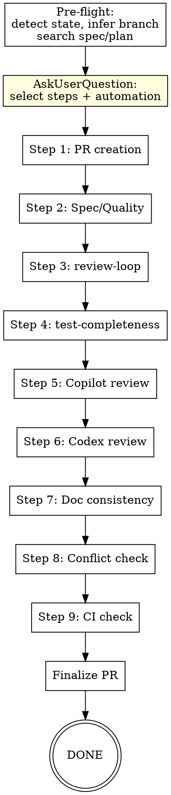

# Finish Feature

Orchestrate a feature branch through a comprehensive quality pipeline before merge. 9 sequential steps, each runs once to completion.

## Overview

```
Pre-flight → Step selection → PR creation → Spec/Quality check → review-loop
→ test-completeness → Copilot review → Codex review → Doc consistency
→ Conflict check → CI verification → Finalize PR → DONE
```

Each step runs once. Later steps do NOT re-trigger earlier steps — CI at the end is the final safety net.

## When to Use

- Feature branch is code-complete and ready for review/merge
- After all implementation tasks are done
- When you want a thorough pre-merge quality gate

**Don't use for:**
- Work-in-progress code that isn't feature-complete yet
- Hotfixes that need immediate merge (do a quick `review-loop` instead)
- Branches with no meaningful code changes

## Process Flow



Skipped steps are bypassed. If `automation=checkpoint`, a pause is inserted after every step. If `automation=full`, a sensitive-decisions report is generated at the end.

## Parameters

All optional — infer from context:

| Parameter | Default | Description |
|-----------|---------|-------------|
| TARGET_BRANCH | Auto-inferred | PR target branch (dev > main; infer → memory → ask user) |
| SPEC_PATH | Auto-searched | Design spec document path |
| PLAN_PATH | Auto-searched | Implementation plan path |
| AUTOMATION | Ask user | `full` / `confirm` / `checkpoint` |

## Pre-flight

Before any step executes, gather context and get user confirmation.

### 1. Detect Project State

- Current branch name (must not be main/dev — you should be on a feature branch)
- Uncommitted changes (`git status`)
- Existing PR for this branch (`gh pr view`)

If uncommitted changes exist, ask user whether to commit first or abort.

### 2. Infer Target Branch

Priority order:
1. Check if `dev` or `develop` branch exists locally or on remote → use it
2. Check memory for this project's default target branch
3. Use `AskUserQuestion` to ask user

Save confirmed target branch to memory for future runs.

### 3. Search for Spec/Plan

Scan `docs/` directory for design/plan documents matching current branch name or recent dates. Also check for `docs/superpowers/specs/` and `docs/superpowers/plans/` patterns. If found, record paths for use in Steps 2-3.

### 4. Present Step Checklist

Use `AskUserQuestion` to present all 9 steps. If a PR already exists with a Quality Checklist, parse it to detect which steps may have already been completed and suggest skipping them.

```
Which steps should I run? (all selected by default)

 [x] 1. PR creation
 [x] 2. Spec/Quality check
 [x] 3. Review loop (Claude)
 [x] 4. Test completeness
 [x] 5. Copilot PR review
 [x] 6. Codex review
 [x] 7. Documentation consistency
 [x] 8. Conflict + upstream check
 [x] 9. CI check

Note: Steps 3, 5 appear already completed based on PR checklist.
```

### 5. Select Automation Level

Use `AskUserQuestion`:

```
Automation level:

 (a) Full auto — AI handles everything autonomously, including decisions,
     error resolution, and trade-offs. Generates a markdown report of
     sensitive decisions at the end for your review.
 (b) Confirm — pauses on errors, trade-off decisions, or when a review
     agent and the controller disagree on an opinion.
 (c) Checkpoint — pauses after every step with summary.
```

## Review Opinion Handling Principle

Applies to ALL steps that receive review feedback (Steps 3, 5, 6). This is a core principle — do not skip it.

```
For each review opinion:
  ├─ Clearly valid → fix code
  ├─ Clearly invalid / false positive →
  │    ├─ Do NOT fix
  │    ├─ Reply with explanation (PR comment for Copilot, summary for Codex)
  │    ├─ Resolve the conversation where applicable
  │    ├─ automation=full → record decision in final report, do not pause
  │    └─ automation=confirm/checkpoint → show user before declining
  └─ Uncertain →
       ├─ automation=full → analyze pros/cons, make a judgment call, record
       │    reasoning in final report (dispatch verifier if needed, but do not
       │    pause for user input)
       ├─ automation=confirm → show user with analysis, let them decide
       ├─ automation=checkpoint → show user with analysis, let them decide
       └─ After judgment → treat as valid or invalid
```

**You MUST validate review opinions independently.** Do not blindly accept or reject. Read the relevant code, understand context, then judge. This applies equally to Claude reviewers, Copilot, and Codex.

## Step 1: PR Creation

```
Check existing PR: gh pr view
  ├─ Already exists → skip, record PR URL and number
  └─ Does not exist → create PR
       ├─ Collect: git log, diff stat, spec summary
       ├─ Generate PR title + body
       ├─ automation=full → create directly
       ├─ automation=confirm/checkpoint → show draft for user confirmation
       └─ gh pr create --draft --title "..." --body "..."
```

**Always create as Draft PR.** Subsequent steps are still running — don't allow premature merge.

PR body must include a **Quality Checklist**. Step 1 (PR creation) is self-evidently complete once the PR exists, so the checklist covers Steps 2-9 (8 items):

```markdown
## Summary
{from spec or git log}

## Quality Checklist
- [ ] Spec/Quality check
- [ ] Review loop (Claude)
- [ ] Test completeness
- [ ] Copilot review
- [ ] Codex review
- [ ] Documentation consistency
- [ ] No merge conflicts
- [ ] CI passing

## Test Plan
{from test files or spec}
```

**After each subsequent step completes**, update the corresponding checkbox via `gh pr edit --body "..."`.

## Step 2: Spec/Quality Check

Route based on available context:

```
Has plan/spec?
  ├─ Has plan → per-task check
  │    ├─ Extract task list + acceptance criteria from plan
  │    ├─ Dispatch spec-checker subagent per task (parallel via Agent tool)
  │    └─ Merge results into summary report
  ├─ Has spec, no plan → per-module check
  │    ├─ Group changed files by module from diff
  │    ├─ Dispatch spec-checker subagent per module (parallel)
  │    └─ Merge results into summary report
  └─ Neither → generic quality check
       ├─ Dispatch subagent for general code quality review on diff
       └─ Check: naming, error handling, type safety, code smells
```

For each subagent, fill the `spec-checker-prompt.md` template. Read it from this skill's directory (`plugins/winrey-toolkit/skills/finish-feature/spec-checker-prompt.md`).

**Placeholder mapping:**

| Placeholder | Source |
|-------------|--------|
| `{MODE}` | `task` (has plan), `module` (has spec, no plan), or `generic` (neither) |
| `{TASK_OR_MODULE}` | Task name from plan, or module/file group name |
| `{ACCEPTANCE_CRITERIA}` | From plan task; empty string if no plan |
| `{SPEC_REQUIREMENTS}` | Relevant spec section content; empty string if no spec |
| `{TARGET_FILES}` | Source file paths with brief descriptions |
| `{PROJECT_CONVENTIONS}` | Language, framework, style conventions |

**You MUST dispatch subagents. Do NOT check spec compliance yourself.** The controller coordinates — it does not review. Even for a single task, dispatch a subagent.

### Spec-Checker Dimensions

| Dimension | Description |
|-----------|-------------|
| Functional completeness | Code implements all features required by spec/task |
| Acceptance criteria | All acceptance criteria from plan are satisfied |
| Interface consistency | Actual APIs/interfaces match spec definitions |
| Code quality | Naming, structure, error handling, type safety |
| Omission detection | Features in spec but missing in code |

### Remediation

- Critical/Important issues → fix code
- automation=confirm: show fix proposal, wait for confirmation
- After fixes → push, update PR body checkbox

## Step 3: review-loop

Invoke skill `winrey-toolkit:review-loop` with:

| Parameter | Value |
|-----------|-------|
| BASE_SHA | Pre-evaluate: `git merge-base HEAD origin/TARGET_BRANCH` → pass the resulting SHA |
| HEAD_SHA | `HEAD` (current commit SHA) |
| DESCRIPTION | From spec summary or PR body; fallback to `git log --oneline` summary |
| PLAN_OR_REQUIREMENTS | Read SPEC_PATH file contents and pass as text (if available) |

The skill handles multi-round iteration, verification, and fixing internally. Controller passes parameters and waits for the result. Do not interfere with review-loop's internal process.

After completion → push, update PR body checkbox.

## Step 4: test-completeness

Invoke skill `winrey-toolkit:test-completeness` with:

| Parameter | Value |
|-----------|-------|
| scope | `diff` |
| base | `TARGET_BRANCH` |
| mode | interactive |

Run in **interactive mode** — allow generating and fixing tests. This is intentional: `finish-feature` is user-initiated, not an automated sub-step, so interactive remediation is appropriate. The skill handles its own dynamic + static audit, remediation loop, and verification internally.

After completion → push, update PR body checkbox.

## Step 5: Copilot PR Review

### 5a: Trigger

```bash
gh pr edit <PR_NUMBER> --add-reviewer @copilot
```

If this fails:
- Repo doesn't have Copilot review enabled → report, skip this step
- Other error → report, ask user whether to skip

### 5b: Wait and Fetch

Poll for Copilot review completion:

```
gh api repos/{owner}/{repo}/pulls/{pr}/reviews
  → Filter: user.login == "copilot-pull-request-reviewer[bot]"
  → Check state: APPROVED / CHANGES_REQUESTED / COMMENTED
  → Poll interval: 30s, max wait: 10 minutes
  → Timeout → ask user: wait longer / skip / manually trigger
```

### 5c: Process Opinions

For each Copilot review comment, apply the **Review Opinion Handling Principle**:

- **Valid** → fix code
- **Invalid** → reply explaining why, then resolve the thread:
  ```bash
  # Reply to comment
  gh api repos/{owner}/{repo}/pulls/{pr}/comments/{id}/replies -f body="..."
  # Get thread ID via GraphQL, then resolve
  gh api graphql -f query='mutation($id: ID!) {
    resolveReviewThread(input: {threadId: $id}) { thread { id } }
  }' -f id='THREAD_NODE_ID'
  ```
- **Uncertain** → judge per automation level

After all opinions processed:
- Push fixes
- Reply "Fixed in <commit_sha>" on fixed comments and resolve them
- Update PR body checkbox

### Notes

- Copilot may return general review text instead of line-by-line comments — handle both
- If all specific opinions are validly declined, the step still passes
- Do NOT re-trigger Copilot after pushing fixes

## Step 6: Codex Review

### 6a: Dispatch

Delegate review to Codex via `codex:rescue` skill (from the `codex` plugin — an external dependency). Construct prompt using `codex-reviewer-prompt.md` template from this skill's directory. The controller must provide the diff content in the prompt since Codex may not have bash tool access.

If `codex:rescue` is not available, fall back to dispatching the `codex-reviewer-prompt.md` via the Agent tool as a regular subagent. The review value is reduced (same model) but still provides a fresh-eyes pass.

**Template placeholders:**

| Placeholder | Source |
|-------------|--------|
| `{DIFF_RANGE}` | BASE_SHA..HEAD |
| `{DIFF_CONTENT}` | Output of `git diff BASE_SHA..HEAD` (provide the actual diff text) |
| `{DESCRIPTION}` | PR/feature description |
| `{SPEC_SUMMARY}` | Key spec requirements (if available) |
| `{PROJECT_CONVENTIONS}` | Language, framework, style conventions |

Codex must output a structured issue list: file path, line number, severity, description, suggested fix.

### 6b: Claude Validates

For each Codex opinion, apply the **Review Opinion Handling Principle**:

- Read relevant code context independently before judging
- Valid → fix code
- Invalid → record rejection reason in summary; if automation=confirm/checkpoint → show user
- Uncertain + automation=full → analyze independently, make judgment call, record reasoning in final report (do not pause)
- Uncertain + automation=confirm/checkpoint → show user with analysis, let them decide

After fixes → push, update PR body checkbox.

### Why Both review-loop AND Codex?

| | Step 3: review-loop | Step 6: Codex review |
|---|---|---|
| Model | Claude subagents | Codex/GPT |
| Rounds | Multi-round until PASS | Single round |
| Verification | Built-in verifier subagent | Claude controller validates |
| Value | Deep iterative polish | Different model catches Claude blind spots |

## Step 7: Documentation Consistency

Dispatch a doc-checker subagent using `doc-checker-prompt.md` template from this skill's directory.

**You MUST dispatch a subagent. Do NOT check documentation yourself.**

**Placeholder mapping:**

| Placeholder | Source |
|-------------|--------|
| `{CHANGED_FILES}` | `git diff --name-only BASE_SHA..HEAD` file list |
| `{DIFF_SUMMARY}` | `git diff --stat BASE_SHA..HEAD` output |
| `{DOC_FILES}` | List of documentation file paths found in project (README, docs/, CHANGELOG, etc.) |
| `{SPEC_CONTENT}` | Read spec file contents; empty string if no spec |
| `{PROJECT_CONTEXT}` | Language, framework, project structure summary |

### Check Dimensions

| Dimension | What to check |
|-----------|---------------|
| README | Feature descriptions match code |
| API docs | Interface changes reflected |
| Spec document | Needs "implemented" marking or updates |
| CHANGELOG | Needs new entry |
| Code comments | Docstrings match implementation |
| Config docs | Env examples, deploy docs need updates |

### Remediation

| Level | Behavior |
|-------|----------|
| `full` | Update documents directly |
| `confirm` / `checkpoint` | Show suggestions, update after user confirmation |

After fixes → push, update PR body checkbox.

## Step 8: Conflict Check + Upstream Impact

### 8a: Conflict Check

```bash
git fetch origin TARGET_BRANCH
git merge --no-commit --no-ff origin/TARGET_BRANCH
```

- No conflicts → `git merge --abort`, continue
- Conflicts → show conflicting files
  - automation=full → attempt auto-resolve with `git merge`; if resolved, commit with standard merge message and record in final report; if unresolvable, report and ask user
  - automation=confirm/checkpoint → show both sides, ask user for strategy
  - After resolution → commit and push

### 8b: Upstream Change Impact

```bash
git log origin/TARGET_BRANCH --not HEAD --oneline
```

- No new commits → skip
- New commits exist → check if target branch modified files touched by current branch:
  ```bash
  git diff HEAD...origin/TARGET_BRANCH -- <files in current branch scope>
  ```
  - No overlap → safe, continue
  - Overlap with no functional impact (formatting, comments) → report, continue
  - Functional impact → report specifics + suggestions
    - automation=full → analyze impact, adapt code if safe, record decision in final report; if risky, ask user
    - automation=confirm/checkpoint → ask user if adaptation needed

After check → update PR body checkbox.

## Step 9: CI Check Loop

```bash
gh pr checks <PR_NUMBER> --watch
```

- All pass → PASS, update checkbox
- Failures:
  1. Fetch logs: `gh run view <run_id> --log-failed`
  2. Analyze: is failure caused by current code?
     - Yes → fix code, push, wait for CI again
     - No (flaky test, infra) → report, offer to rerun: `gh run rerun <run_id> --failed`
  3. Max 3 fix rounds. After 3 → stop, report remaining failures, ask user
- No CI configured → report, skip

## Finalize PR

After all steps complete:

1. **Update PR body:** check all completed checkboxes, append finish report summary
2. **Remove draft:** `gh pr ready <PR_NUMBER>`
3. **Output report:**

```
## Feature Finish Report

**PR:** #123 — {title}
**Branch:** feature/xxx → TARGET_BRANCH
**Steps executed:** 7/9 (skipped: 4, 6)

| Step | Status | Summary |
|------|--------|---------|
| 1. PR creation | DONE | Created #123 (draft) |
| 2. Spec/Quality | PASS | 5 tasks checked, 2 issues fixed |
| 3. review-loop | PASS | 3 rounds, 8 issues fixed |
| 4. test-completeness | SKIPPED | User skipped |
| 5. Copilot review | PASS | 4 comments: 3 fixed, 1 declined |
| 6. Codex review | SKIPPED | User skipped |
| 7. Documentation | PASS | README updated |
| 8. Conflicts | PASS | No conflicts, no upstream impact |
| 9. CI | PASS | All checks green |

PR Status: Draft removed, all checks passed, ready for merge.
```

4. **Sensitive decisions report (automation=full only):** Output a separate report listing every autonomous decision made during the pipeline — declined review opinions, uncertain calls, conflict resolutions, trade-off choices. For each decision, include: what the decision was, the reasoning/pros-cons analysis, and which step it occurred in. This allows the user to audit AI judgment after the fact.

```
## Sensitive Decisions Report (Full Auto)

| # | Step | Decision | Reasoning |
|---|------|----------|-----------|
| 1 | 3. review-loop | Declined reviewer suggestion to extract helper | One-time operation, abstraction adds complexity without reuse benefit |
| 2 | 5. Copilot | Fixed null check despite low severity | Defensive — edge case possible in production |
| 3 | 8. Conflicts | Auto-resolved merge in config.ts | Only whitespace/formatting difference, no functional change |
```

5. **Memory update:** if first time confirming target branch for this project, save to memory

## Error Recovery

| Scenario | Behavior |
|----------|----------|
| Step fails, cannot auto-fix | Report reason, ask user: skip / fix manually then continue / abort |
| Conversation interrupted | Next run detects PR checklist, suggests skipping completed steps |
| Push permission denied | Report error, suggest checking git remote config (SSH → HTTPS fallback) |
| Copilot review unavailable | Report, skip step, continue pipeline |
| Codex unavailable | Report, skip step, continue pipeline |

## Common Mistakes

| Mistake | Fix |
|---------|-----|
| Reviewing code yourself instead of dispatching subagents | Always dispatch subagents for Steps 2, 7. Controller coordinates, never reviews |
| Blindly accepting all review opinions | Apply Review Opinion Handling Principle — validate each opinion independently |
| Blindly rejecting review opinions | Read the code, understand context, then judge. When uncertain, lean conservative |
| Re-running earlier steps after later fixes | Each step runs once. CI at the end is the backstop |
| Creating non-draft PR | Always create as draft — remove draft only in Finalize step |
| Forgetting to update PR body checkbox | Update after EVERY step completion |
| Skipping AskUserQuestion for step selection | Always ask — user may want to skip steps already done |
| Not pushing after fixes | Push after every step that modifies code |

## Integration

| Skill | Relationship |
|-------|-------------|
| `review-loop` | Invoked as Step 3; handles its own multi-round loop |
| `test-completeness` | Invoked as Step 4; handles its own audit-fix loop |
| `codex:rescue` | Used in Step 6 to dispatch Codex review |
| `verification-before-completion` | Complementary — `finish-feature` is a superset |
| `writing-plans` | Plans can include `finish-feature` as the final acceptance step |
