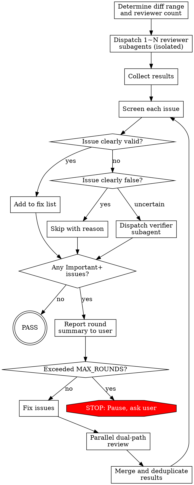

# Review Loop

Iterative code review with isolated subagents. Loops until clean.

## Overview

Dispatch independent reviewer subagents → screen and verify findings → fix confirmed issues → parallel dual-path re-review (fix diff + full review) → repeat until no Critical or Important issues remain.

Each reviewer is fully isolated: no prior review conclusions, no conversation history, no knowledge of previous fixes. Only the round number and diff range are provided.

## When to Use

- After completing a feature branch, before merge
- After each task in an implementation plan
- When code quality needs thorough, iterative validation
- When a single-shot review (`requesting-code-review`) isn't sufficient

**Don't use for:**
- Quick sanity checks — use `requesting-code-review` instead
- Review of other people's PRs — this is for your own code iteration

## Process Flow



## Parameters

All optional — infer from context:

| Parameter | Default | Description |
|-----------|---------|-------------|
| BASE_SHA | Auto-inferred | Review start point |
| HEAD_SHA | HEAD | Review end point |
| DESCRIPTION | From git log | Brief change description |
| PLAN_OR_REQUIREMENTS | From context | Spec or requirements doc |
| MAX_ROUNDS | 5 | Max rounds before pausing |

**Auto-inference:**
1. Explicit commit range in conversation → use it
2. Branch has unmerged commits vs main → BASE = merge-base, HEAD = HEAD (includes uncommitted)
3. Only uncommitted changes → review working tree diff
4. Nothing → ask user

## Step 1: Determine Reviewer Count

Assess change scope with `git diff --stat`:

| Scope | Reviewers | Example focus split |
|-------|-----------|-------------------|
| Small (<100 lines, 1-2 files) | 1 | Full coverage |
| Medium (100-500 lines, multi-file) | 2 | A: logic/security/edge; B: architecture/maintainability |
| Large (>500 lines, cross-module) | 2-3 | A: logic/security; B: architecture/patterns; C: spec/tests |

Adapt focus areas to code characteristics. Database-heavy → SQL injection/transactions reviewer. UI-heavy → accessibility/UX reviewer.

## Step 2: Dispatch Reviewers

For each reviewer, fill `reviewer-prompt.md` template and dispatch via Agent tool:
- Each reviewer is a **separate** Agent call — they run in parallel
- Provide only: round number, diff range, description, focus areas, project conventions
- **Never** provide: prior review results, fix history, controller opinions
- Before dispatching, check for locally installed review skills (e.g. `requesting-code-review`, `code-reviewer` agents) and reference their output format conventions to keep reviewer output consistent with project norms

**You MUST dispatch subagents. Do NOT review the code yourself.** Even for 1 reviewer on a small diff, dispatch a subagent. The controller's job is to coordinate, screen, and fix — not to review. Reviewing your own code (or code you just read) defeats the isolation principle. If you catch yourself thinking "I'll just review it myself, it's small" — that's the exact rationalization this rule prevents.

## Step 3: Screen Results

For each issue reported by any reviewer:

1. **Clearly valid and necessary** → add to fix list
2. **Clearly false positive** (code doesn't have this problem, or reviewer missed context) → skip, record reason
3. **Uncertain** → dispatch verifier subagent with `verifier-prompt.md`:
   - Provide: issue description, file paths, project conventions
   - Do NOT provide: which reviewer, your leaning
   - Verifier returns: Confirmed / Not confirmed / Exists but no fix needed

**Multi-reviewer dedup:** Same file:line with same issue type → merge, take higher severity.

## Step 4: Report Round Summary to User

After screening, report with full issue details:

```
## Round N Review

### Issue Details

| # | Level | Description | Decision | Reason |
|---|-------|-------------|----------|--------|
| 1 | Critical | ... | Fix | ... |
| 2 | Important | ... | Fix | ... |
| 3 | Important | ... | Rejected | False positive: ... |
| 4 | Minor | ... | Verified → Fix | Verifier confirmed |
| 5 | Minor | ... | Skipped | Non-blocking, cosmetic |

Decision values: Fix / Rejected / Verified → Fix / Verified → Rejected / Skipped

### Summary
- Issues found: X (Critical: a, Important: b, Minor: c)
- Confirmed to fix: Y, Rejected: Z
- Status: continuing / passed / paused at limit

### Convergence Trend (Round 2+)
- Round 1: 5 issues (C:1 I:3 M:1) → Round 2: 2 issues (C:0 I:1 M:1) → ...
- Trend: converging / stable / diverging
- If diverging or stable after 2+ rounds: note possible cause and suggest strategy adjustment
```

**Convergence rules:**
- **Converging**: Important+ count strictly decreasing across rounds → continue
- **Stable**: Important+ count unchanged for 2 consecutive rounds → flag to user, suggest reviewing fix quality or adjusting strategy
- **Diverging**: Important+ count increasing → stop and ask user before continuing

If no Important+ issues → report and exit (PASS).

## Step 5: Fix Confirmed Issues

Choose strategy based on issue characteristics:

- **Simple issues** (typo, missing null check, small logic fix) → fix directly
- **Complex single issue** (architectural change, multi-file refactor) → dispatch 1 fixer subagent
- **Multiple independent issues** → dispatch N fixer subagents in parallel (one per issue or per related group)

Fixer subagents receive: issue description, file paths, project conventions, concrete fix suggestion from reviewer. They commit their fixes.

## Step 6: Dual-Path Parallel Review

After fixes, dispatch two review paths **in parallel**:

**Path A — Fix diff review:**
- 1 subagent with `fix-reviewer-prompt.md`
- Diff range: only the fix commits
- Does NOT know what the original issues were

**Path B — Full review (new round):**
- 1~N subagents with `reviewer-prompt.md` (same count logic as Step 1)
- Diff range: original BASE_SHA..HEAD (now includes fixes)
- Fully isolated — no knowledge of any prior round

Both paths return results → merge and deduplicate → back to Step 3.

## Step 7: Termination

**Pass condition:** No Critical or Important issues after screening. Minor issues listed but don't block.

**Max rounds (default 5):** After MAX_ROUNDS cycles, pause and present to user:
- Remaining Important+ issue list
- Summary of all rounds
- Recommendation: continue, stop, or adjust strategy

**Ask user when:**
- Fix direction involves architectural trade-offs
- Verifier contradicts reviewer and you can't judge
- Fix scope exceeds current task boundaries

## Final Output

```
## Review Loop Result

### Convergence Summary
- Round 1: X issues (C:a I:b M:c) → Round 2: Y issues (C:d I:e M:f) → ...
- Trend: converging / stable / diverging
- Important+ trajectory: [count per round, e.g. 4 → 2 → 0]

### Result
- Total rounds: N
- Status: Passed / User terminated
- Total issues found: X, Total fixed: Y, Total rejected: Z
- Remaining Minor issues: (list, optional fix)
```

## Isolation Principles

| What | Rule |
|------|------|
| Prior review conclusions | Never passed to next round's reviewers |
| Prior fix content | Full reviewers don't know; fix reviewer only sees diff range |
| Conversation history | Not inherited; every subagent starts fresh |
| Round info | Only round number ("Round N") — no history details |
| Controller opinions | Never shared with verifiers |

**Why isolation matters:** Without it, later-round reviewers anchor on earlier findings and miss new issues.

## Common Mistakes

| Mistake | Fix |
|---------|-----|
| Passing prior review results to new reviewer | Only provide round number and diff range |
| Skipping verification for "obvious" issues | If unsure, dispatch verifier — it's cheap |
| Fixing all issues yourself instead of parallelizing | Multiple independent issues → parallel fixer subagents |
| Running only full review after fix (no fix-diff review) | Always dual-path: fix diff + full review in parallel |
| Telling fix reviewer what the original issues were | Causes confirmation bias — let them judge independently |
| Batching all rounds before reporting to user | Report after EVERY round — user needs visibility |
| Omitting issues from review output | Reviewers MUST list ALL issues exhaustively |
| Stopping loop after one clean round without verifying | If fixes were made, dual-path review IS the verification |
| Reviewing the code yourself instead of dispatching subagent | Controller coordinates — NEVER reviews. Even for small diffs, dispatch a subagent |

## Integration

| Skill | Relationship |
|-------|-------------|
| `requesting-code-review` | Complementary — single-shot vs. iterative loop |
| `subagent-driven-development` | Can invoke `review-loop` as review step per task |
| `receiving-code-review` | Controller applies its verify-before-act principles |
| `verification-before-completion` | Use after `review-loop` passes for final check |