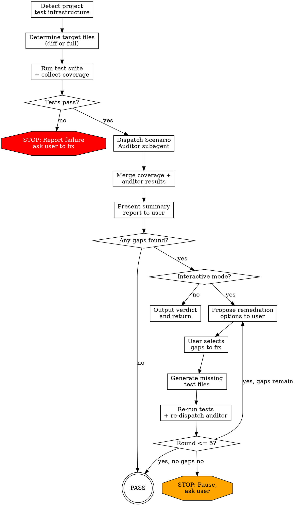

# Test Completeness

Audit test completeness across two phases: dynamic (run tests, collect real coverage) and static (subagent analyzes scenarios across 6 dimensions). Then propose and generate missing tests interactively.

## Overview

**Phase 1 — Dynamic:** Run the test suite and collect live coverage data. This gives real line/branch percentages and identifies which code paths are actually exercised.

**Phase 2 — Static:** Dispatch a Scenario Auditor subagent that independently reads source files, test files, and coverage data to audit across 6 dimensions: good case, bad case, boundary cases, unit tests, integration tests, and e2e tests.

Results from both phases are merged into a single report. In interactive mode, you then propose remediation, generate missing tests, and re-run in a verification loop (max 5 rounds). In non-interactive mode, output the verdict and return.

## When to Use

- After implementing a feature or fix, before merging
- When a code review surfaces test coverage concerns
- When running `review-loop` reveals missing tests
- When a PR touches files with no or low test coverage
- Periodically on a codebase to establish baseline test health

**Don't use for:**
- Checking whether a single assertion is correct — read the test manually
- Auditing documentation or non-code files
- Projects with no test infrastructure at all (ask user to set up tests first)

## Process Flow



## Parameters

All optional — infer from context:

| Parameter | Default | Description |
|-----------|---------|-------------|
| scope | `diff` | `diff` = only files changed in current branch vs base; `full` = entire codebase |
| base | `main` | Base branch for diff comparison (e.g. `main`, `master`, `develop`) |

**Scope inference:**
1. Explicit scope in conversation → use it
2. On a feature branch with unmerged commits → use `diff` mode
3. User asks for full audit or there's no clear diff context → use `full` mode
4. Ambiguous → ask user

## Step 1: Detect Project Test Infrastructure

Before running anything, detect what tooling the project uses:

| Detection Target | What to Detect | Method |
|-----------------|----------------|--------|
| Language | Primary language(s) | File extensions, `package.json`, `Cargo.toml`, `go.mod`, `pyproject.toml`, etc. |
| Test framework | Jest, pytest, Go test, Cargo test, Mocha, Vitest, etc. | Config files, `devDependencies`, `[dev-dependencies]`, test script in `package.json` |
| Test runner command | `npm test`, `pytest`, `go test ./...`, `cargo test`, etc. | `scripts.test` in `package.json`, `Makefile`, CI config, `pyproject.toml` |
| Coverage tool | Istanbul/nyc, coverage.py, `go test -cover`, `cargo tarpaulin`, c8, etc. | Coverage config, existing CI scripts |
| Test directories | `__tests__/`, `tests/`, `test/`, `spec/`, `*.test.ts`, `*_test.go`, etc. | Directory scan + file pattern matching |
| Test layers | Which of unit/integration/e2e exist | Directory names, test file naming conventions, CI config |

**Fallback for no framework detected:** Ask the user: "I couldn't detect a test framework. What test runner does this project use?" Do not proceed until confirmed.

**Fallback for no coverage tool:** Run tests without coverage. Note in the report that coverage data is unavailable. Static audit via Scenario Auditor still runs.

**Output of Step 1:** A project context block used to fill the auditor prompt:

```
Language: TypeScript
Framework: Jest
Runner: npm test
Coverage: Istanbul (nyc) via jest --coverage
Test dirs: src/**/__tests__/, src/**/*.test.ts
Layers detected: unit, integration
```

## Step 2: Dynamic Data Collection

### 2a: Determine Target Files

**Diff mode (`scope=diff`):**
```bash
git diff --name-only $(git merge-base HEAD origin/main) HEAD \
  | grep -v test | grep -v spec | grep -E '\.(ts|js|py|go|rs)$'
```
Filter out: test files, spec files, generated files, config files, type-only files.

**Full mode (`scope=full`):**
Collect all source files matching the language extension, excluding test files and vendor directories.

**If no target files after filtering:** Report "No source files in scope" and exit. (See Edge Cases.)

### 2b: Run Test Suite

Run the detected test command with coverage enabled. Examples:

| Stack | Command |
|-------|---------|
| Node/Jest | `npx jest --coverage --coverageReporters=json-summary --coverageReporters=text` |
| Node/Vitest | `npx vitest run --coverage` |
| Python/pytest | `pytest --cov=. --cov-report=json --cov-report=term-missing` |
| Go | `go test ./... -coverprofile=coverage.out && go tool cover -func=coverage.out` |
| Rust | `cargo tarpaulin --out Json` |

**If tests fail:** Stop immediately. Report:
```
## Test Completeness — BLOCKED

Tests are currently failing. Fix the failing tests before running a completeness audit.

Failing tests:
- [paste test output summary]

Re-run /test-completeness after tests pass.
```
Do not proceed to Step 3.

### 2c: Parse Coverage Data

Extract per-file coverage percentages. Minimum to capture:
- Line coverage %
- Branch coverage % (if available)
- Uncovered line ranges (e.g., L10-L15, L30)

Store as structured data keyed by file path for use in the auditor prompt.

## Step 3: Dispatch Scenario Auditor

Fill the `auditor-prompt.md` template with the collected data and dispatch via Agent tool.

**Placeholder mapping:**

| Placeholder | Data source |
|-------------|-------------|
| `{SCOPE}` | `diff` or `full` + description (e.g. "diff — files changed vs main") |
| `{DESCRIPTION}` | Git log summary for diff scope; "Full codebase audit" for full scope |
| `{PROJECT_CONTEXT}` | Output of Step 1 detection block |
| `{TARGET_FILES}` | List of target source files with their paths and brief descriptions |
| `{TEST_FILES}` | List of existing test files, grouped by which source file they test |
| `{COVERAGE_DATA}` | Per-file coverage percentages and uncovered line ranges from Step 2c |

**You MUST dispatch a subagent. Do NOT analyze the code yourself.** The controller's role is to coordinate and synthesize results. Even for a single file, dispatch the Scenario Auditor — it reads code with fresh eyes and no anchoring bias. If you catch yourself thinking "I'll just check it quickly" — that is exactly the rationalization this rule prevents.

Dispatch as a single Agent call with the filled prompt. The auditor runs to completion and returns structured results per file.

## Step 4: Merge Results and Present Summary Report

Merge coverage data (Step 2) with auditor findings (Step 3) into a unified report:

```
## Test Completeness Report — Round N

**Scope:** diff (12 files) / full (47 files)
**Coverage:** 78% line, 65% branch (project average)

### Per-File Summary

| File | Line% | Branch% | Good | Bad | Boundary | Unit | Integration | E2E | Issues |
|------|-------|---------|------|-----|----------|------|-------------|-----|--------|
| src/auth.ts | 92% | 80% | PASS | FAIL | FAIL | PASS | PASS | N/A | 3 |
| src/utils.ts | 100% | 100% | PASS | PASS | PASS | PASS | N/A | N/A | 0 |
| src/api/handler.ts | 45% | 30% | FAIL | FAIL | FAIL | FAIL | FAIL | FAIL | 8 |

### Issue Summary

| # | File | Severity | Dimension | Description |
|---|------|----------|-----------|-------------|
| 1 | src/auth.ts | Important | Bad case | validateToken() error path not tested |
| 2 | src/auth.ts | Important | Boundary | null input to parseJWT() missing |
| 3 | src/api/handler.ts | Critical | Good case | handleRequest() has zero tests |

### Overall Verdict

- Critical issues: X
- Important issues: Y
- Minor issues: Z
- Status: FAIL — X Critical, Y Important issues found
```

**Non-interactive mode:** Output this report and return. Do not proceed to Step 5. Add at the end:
```
[Non-interactive mode] Re-run with interactive mode to generate missing tests.
```

## Step 5: Remediation Proposal

Present gaps grouped by file, and offer the user choices:

```
## Remediation Options

I found X gaps across Y files. What would you like to do?

  a) Fix ALL gaps — generate tests for every Critical and Important issue
  b) Fix Critical only — generate tests for zero-coverage and zero-test functions
  c) Fix by file — I'll list files; pick which ones to address
  d) Fix by dimension — choose which dimensions to fix (e.g., "fix all bad case gaps")
  e) Skip — exit without generating tests (issues remain on record)

Your choice (a/b/c/d/e):
```

Wait for user input before proceeding. After user selects:

1. **Group selected gaps** by file and dimension
2. **Generate test code** for each selected gap (see guidelines below)
3. **Show generated tests** to user for confirmation before writing:
   ```
   I'll add the following tests to src/__tests__/auth.test.ts:
   [show test code]
   Confirm? (yes/edit/skip):
   ```
4. **Write confirmed tests** to the appropriate test files

**Test generation guidelines:**
- Match the existing test framework, style, and patterns exactly — read existing tests first
- Place tests in the location matching project conventions (same directory, `__tests__/` subfolder, etc.)
- For bad case tests: use realistic inputs that trigger the actual error path
- For boundary tests: test one boundary per test case — don't combine all boundaries in one test
- For integration tests: use existing test helpers/fixtures — don't invent new infrastructure
- Keep test descriptions specific: `"returns null when input is empty string"` not `"handles edge case"`
- Never write tests that simply call a function and check it doesn't throw — test actual outcomes
- If a test requires infrastructure that doesn't exist (e.g., test database, mock server), note this as a prerequisite and ask the user before writing

## Step 6: Verification Loop

After generating tests, re-run the full pipeline (Steps 2-4) to verify the gaps are closed.

**Loop structure:**
- Re-run tests + collect new coverage
- Re-dispatch Scenario Auditor with updated file list and coverage
- Merge and present new report, highlighting what changed

**Loop summary format:**
```
## Verification Round N

Tests run: PASS (X passing, 0 failing)
Coverage change: 78% → 85% line, 65% → 72% branch

Gaps closed: 5
Gaps remaining: 2

Remaining issues:
| # | File | Severity | Dimension | Description |
|---|------|----------|-----------|-------------|
| 1 | src/api/handler.ts | Important | Integration | DB interaction still untested |
| 2 | src/api/handler.ts | Minor | E2E | No e2e test for POST /handler |
```

**Max 5 rounds.** After round 5 with remaining gaps, stop and present:
```
## Verification — Max Rounds Reached

After 5 rounds, the following gaps remain unresolved:
[list remaining issues]

Possible reasons:
- Tests require infrastructure not yet set up
- Gaps require architectural changes beyond test generation
- Issues are in autogenerated or vendored code

Recommendation: Review the remaining gaps manually or adjust the scope.
```

## Severity Definitions

| Severity | Definition | Examples |
|----------|------------|---------|
| Critical | Function or module has zero tests; file with business logic at 0% coverage | Public function with no test file; entire module untouched by any test |
| Important | Missing bad case or boundary tests for existing functions; missing a full test layer that applies; coverage gaps on non-trivial logic | validateInput() has no error path test; service with DB calls has no integration tests; 40% branch coverage on branching logic |
| Minor | Tests exist but scenarios not comprehensive enough; test organization could improve | Happy path test exists but only tests one input value; test descriptions are generic |

## Edge Cases

| Scenario | Behavior |
|----------|----------|
| No test framework detected | Prompt user to identify framework. Do not proceed until confirmed. |
| No coverage tool available | Run tests without coverage. Flag "Coverage data unavailable" in report. Static audit still runs. |
| Tests fail on initial run | Stop immediately. Report failing tests. Do not dispatch auditor. Ask user to fix tests first. |
| No changed files in diff scope | Report "No source files in scope for this diff." Exit with PASS — nothing to audit. |
| File marked N/A for a dimension | Auditor sets that dimension to N/A. Do not count N/A as a gap. Do not propose tests for N/A dimensions. |
| Missing test infrastructure (e.g., no test DB) | Note as prerequisite in remediation. Ask user before writing tests that depend on it. |

## Common Mistakes

| Mistake | Fix |
|---------|-----|
| Analyzing code yourself instead of dispatching auditor | Always dispatch the Scenario Auditor subagent — do not review code directly |
| Proceeding when tests are failing | Stop at Step 2b and ask user to fix tests first |
| Counting N/A dimensions as failures | N/A means not applicable — no test needed, not a gap |
| Generating tests without reading existing test patterns | Always read existing test files before generating new ones |
| Writing all boundary cases in a single test | One test per boundary value — keeps failures isolated and readable |
| Proposing tests before user confirms | Show generated test code and wait for user confirmation before writing |
| Running more than 5 verification rounds | After round 5, stop and present remaining gaps with explanation |
| Using diff scope when no branch context exists | Fall back to full scope or ask user when diff is ambiguous |

## Integration

| Skill | Relationship |
|-------|-------------|
| `review-loop` | Run `test-completeness` when `review-loop` surfaces missing tests — fixes the gap before re-review |
| `verification-before-completion` | Complement — `verification-before-completion` checks work is done; `test-completeness` checks tests are complete. Run both before merging. |
| `feature-dev` | Run `test-completeness` as the final step of feature development, after implementation is complete |
| `writing-plans` | Include a `test-completeness` step at the end of implementation plans that involve new or modified code |

**Non-interactive mode note:** When invoked from another skill (e.g., as a step inside `feature-dev` or `writing-plans`), run in non-interactive mode. Output the verdict report and return — do not prompt the user for remediation choices. The calling skill decides what to do with the results.
